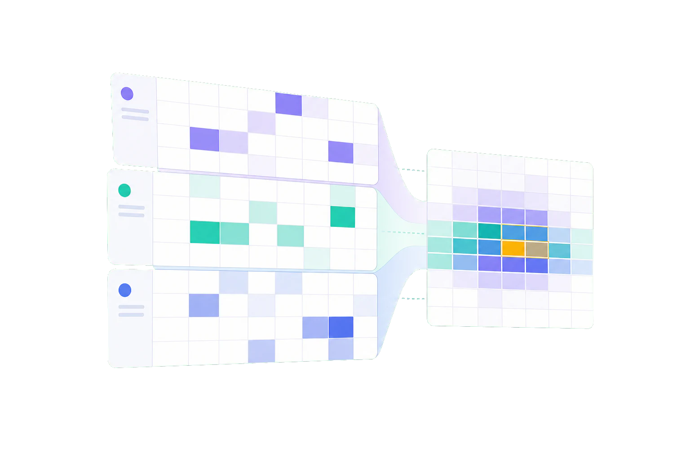
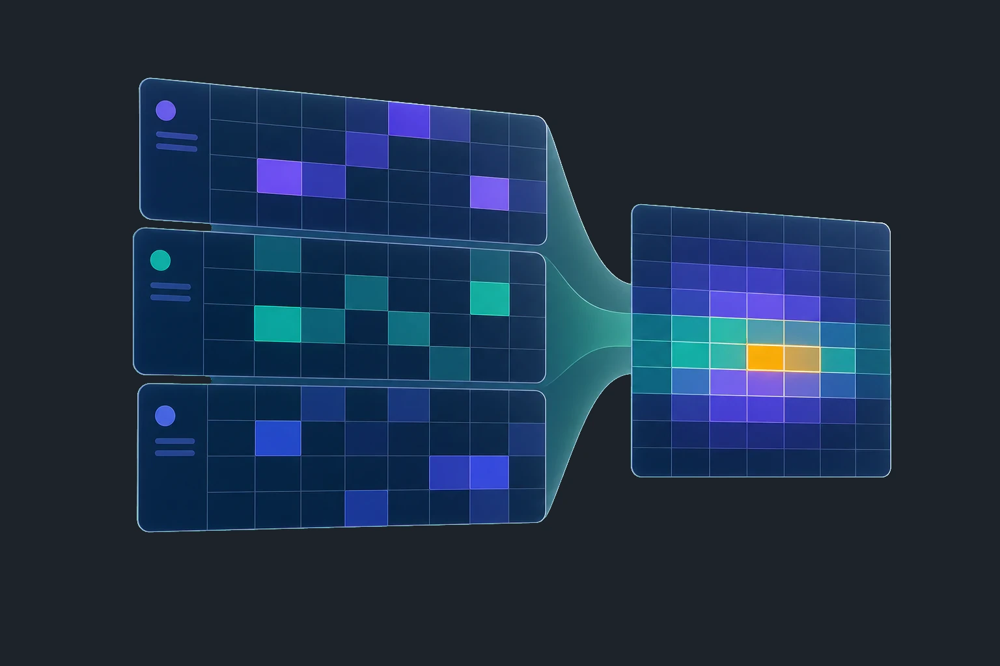

# DaySynth

DaySynth は、学生団体、サークル、バンド練習、小規模チーム向けの予定調整アプリです。ログイン不要で候補日を共有し、参加者の空き時間を集めて、複数の予定をまとめて確定できます。スマホ中心の操作性を重視し、ICS 出力や Google Calendar 連携にも対応しています。

## サービス概要

DaySynth は「短時間で集まれる候補を決める」ことに特化した、再利用しやすい OSS の予定調整基盤です。イベント作成から回答収集、確定、カレンダー連携までを一連の流れで扱えます。

## 解決する課題

- 参加者全員の予定を手作業で照合する負担を減らします。
- ログイン必須の重い導線を避け、招待リンクだけで調整を始められます。
- 複数の確定予定を扱えるため、練習日と予備日などをまとめて管理できます。
- ICS と Google Calendar の連携で、確定後の反映漏れを減らします。

## 主な機能

- ログイン不要の公開回答フロー
- 期間から候補日を自動生成するイベント作成
- カレンダー上での手動選択による候補調整
- 空き時間の可視化
- 複数予定の確定とカレンダー連携
- ICS ダウンロードと Google Calendar 連携
- Google ログイン時の履歴同期、お気に入り、アカウントページ
- 予定テンプレートの管理と回答の自動反映

## 技術スタック

- Next.js App Router
- TypeScript
- React 19
- Supabase
- Supabase RLS
- NextAuth
- Tailwind CSS / daisyUI
- Jest
- Playwright

## デモURL

- 公開デモ: [https://daysynth.k-tkms.com/](https://daysynth.k-tkms.com/)

## スクリーンショット

以下は公開ページの主要ビジュアルです。





## セットアップ手順

### 前提条件

- Node.js 20 以上
- npm 10 系
- Docker
- Supabase CLI

### 1. リポジトリを取得

```bash
git clone <repository-url>
cd multi-schedule-app
```

### 2. 依存関係をインストール

```bash
npm ci
```

### 3. 環境変数を用意

```bash
cp .env.example .env.local
```

Supabase のローカル環境を起動して、表示された値を `.env.local` に反映します。

### 4. Supabase ローカル環境を起動

```bash
npx supabase start
```

### 5. 開発サーバーを起動

```bash
npm run dev
```

## 環境変数

`.env.example` に最小構成を置いています。主な変数は次のとおりです。

| 変数                        | 用途                                      |
| --------------------------- | ----------------------------------------- |
| `SUPABASE_URL`              | Supabase API の URL                       |
| `SUPABASE_ANON_KEY`         | クライアント公開用キー                    |
| `SUPABASE_SERVICE_ROLE_KEY` | サーバー側で使う管理キー                  |
| `SUPABASE_DB_URL`           | ローカルまたは接続先 DB URL               |
| `SUPABASE_DB_PASSWORD`      | Supabase ローカル DB のパスワード         |
| `NEXTAUTH_SECRET`           | NextAuth の署名用シークレット             |
| `NEXTAUTH_URL`              | アプリのベース URL                        |
| `GOOGLE_CLIENT_ID`          | Google ログイン用クライアント ID          |
| `GOOGLE_CLIENT_SECRET`      | Google ログイン用クライアントシークレット |

### 開発用ログイン

ローカルでは開発用ログインを有効化できます。

```bash
ENABLE_DEV_LOGIN=true
NEXT_PUBLIC_ENABLE_DEV_LOGIN=true
DEV_LOGIN_ID=devuser
DEV_LOGIN_PASSWORD=devpass
```

本番環境では自動で無効化される前提です。

## Supabase設定の概要

- `supabase/migrations/` にスキーマ変更を追加します。
- ローカル検証は `npx supabase start` と `npx supabase db reset` を使います。
- 型定義は `npx supabase gen types typescript --linked > src/lib/database.types.ts` で更新します。
- クライアントから DB へ直接アクセスせず、サーバー経由で処理します。
- RLS を前提に、公開データと認証データの境界を明確にしています。

### よく使う Supabase コマンド

```bash
npx supabase stop
npx supabase status
npx supabase migration new <name>
npx supabase migration up
npx supabase db reset
npx supabase db push
npx supabase gen types typescript --linked > src/lib/database.types.ts
```

## 開発コマンド

| コマンド                         | 用途                              |
| -------------------------------- | --------------------------------- |
| `npm run dev`                    | 開発サーバー起動                  |
| `npm run build`                  | 本番ビルド                        |
| `npm run start`                  | ビルド済みアプリ起動              |
| `npm run lint`                   | ESLint 実行                       |
| `npm run typecheck`              | 型チェック                        |
| `npm run test`                   | Jest ウォッチ実行                 |
| `npm run test:ci`                | CI 向け Jest 実行                 |
| `npm run test:unit`              | Jest 実行                         |
| `npm run test:e2e`               | Playwright 実行                   |
| `npm run test:e2e:chrome`        | 公開フロー + 認証フローの推奨実行 |
| `npm run test:e2e:chrome:public` | 公開フローのみ                    |
| `npm run test:e2e:auth`          | 認証フローのみ                    |
| `npm run format`                 | Prettier で整形                   |

## デプロイ方法

- Vercel へのデプロイを想定しています。
- `vercel.json` で `/api/cron` の定期実行を設定しています。
- 本番環境では `SUPABASE_URL`、`SUPABASE_ANON_KEY`、`SUPABASE_SERVICE_ROLE_KEY`、`NEXTAUTH_SECRET`、`NEXTAUTH_URL`、Google OAuth の設定を用意してください。
- デプロイ前に `npm run build` と `npm run test:ci` を通しておくと安心です。

## ロードマップ

- 公開フローの導線改善
- カレンダー連携の分かりやすいガイド強化
- 小規模コミュニティ向けの共有テンプレート拡充
- 自己ホスト向けセットアップ手順の簡略化
- 英語ドキュメントの拡充

## コントリビューション案内

- 変更前に関連する仕様書と既存実装を確認してください。
- 仕様に関わる変更は、先に issue で意図を共有すると安全です。
- 変更後は `npm run lint`、`npm run typecheck`、`npm run test:ci` を実行してください。
- UI 変更には必要に応じて Playwright のテストを追加してください。
- 秘密情報、個人情報、非公開 URL はコミットしないでください。

詳細は [CONTRIBUTING.md](CONTRIBUTING.md) を参照してください。

## ドキュメント

- [カレンダー操作UI共通ロジック](docs/architecture/calendar-interaction.md)
- [アクセス権限・閲覧方針](docs/architecture/access-policy.md)
- [プライバシーポリシー検討メモ](docs/architecture/privacy-policy.md)
- [イベント作成ウィザード設計メモ](docs/architecture/create-wizard.md)
- [回答ウィザード設計メモ](docs/architecture/answer-wizard.md)
- [イベント日程確定フロー設計メモ](docs/architecture/event-finalize-flow.md)
- [アカウント予定連携の設計](docs/architecture/account-schedule.md)
- [アカウントページ新規ユーザーツアー設計](docs/architecture/account-onboarding-tour.md)
- [体感最適化と整合性担保](docs/architecture/performance-latency-improvements.md)
- [Motion導入方針（低影響・段階移行）](docs/architecture/motion-adoption-plan.md)
- [AI駆動開発におけるデザイン品質ガイド](docs/architecture/ai-driven-design-guidelines.md)
- [デザイン改善メモ（2026-05-11）](docs/architecture/design-refresh-2026-05-11.md)
- [Googleログインとイベント履歴同期の設計](docs/auth/google-login-design.md)

## ライセンス

- MIT License を採用しています。詳細は [LICENSE](LICENSE) を参照してください。
- Copyright (c) 2026 @takemasa32
