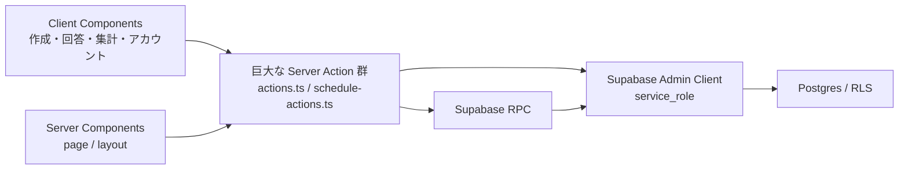
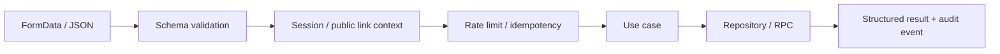

# DaySynth 次期プロダクトアーキテクチャ案

> **2026-08-13 方針更新:** 本文のcapability / 管理リンク / 権限分離案は採用しない。公開リンク利用者の権限は現行どおり維持する。本書のfeature分割、入力境界、日時統一、品質ゲートの提案だけを継承し、実装順は [見た目・使い勝手を維持する性能 / UX 改善方針](performance-ux-preservation-plan-2026-08-13.md) を正とする。

作成日: 2026-07-29

## 1. 目的

この文書は、DaySynth を「動く日程調整アプリ」から「安心して繰り返し使える調整基盤」へ進化させるための設計案である。

優先する品質は次の順とする。

1. 誤操作と不正変更を防ぐ
2. 回答と確定を短時間で終えられる
3. 新しい調整ルールを安全に追加できる
4. 問題を計測し、再現し、修正できる
5. UIの見た目を一貫して改善できる

## 2. 現状の構造と限界



現行方針の良い点:

- DB接続はサーバーに閉じている。
- 複数更新を RPC にまとめ、トランザクション境界を作っている。
- 読み取りは Server Components、操作部分だけ Client Components に寄せている。
- SQLマイグレーションとRLSテストがある。

限界:

- UI状態、入力整形、現行アクセス方針の確認、DB呼び出し、エラー文言が同じファイルへ混在する。
- `actions.ts` は1,471行 / 17公開関数 / 40 `console.error`、`schedule-actions.ts` は1,662行 / 14公開関数 / 27 `console.error`。
- `availability-form.tsx` は1,476行 / 19 `useState` / 8 `useEffect`、アカウント予定設定は1,265行 / 20 `useState`。
- 現行の同一権限方針を維持しながら、入力上限、濫用制限、処理失敗の境界を共通化できていない。
- FormData を個別キャストして検証するため、文字数、配列件数、許容値、相関条件が入口ごとに分散する。

## 3. 不採用案の記録: 権限モデルを capability ベースへ変更する

### 3.1 現行の問題

現行文書は「リンクを知っている全員を同じ権限」としている。これは回答開始の摩擦を下げる一方、候補追加、回答閲覧、日程確定などの重要操作にも同じ信頼を置く。

サービスが広く共有されるほど、誤確定、第三者による変更、参加者名の閲覧、リンク流出時の復旧不能が主催者の不安になる。

### 3.2 推奨する権限

| capability  | 入手方法                                       | 許可                                     |
| ----------- | ---------------------------------------------- | ---------------------------------------- |
| `viewer`    | 公開リンク                                     | イベント概要と公開設定された集計を閲覧   |
| `responder` | 公開リンク                                     | 新規回答、自分の回答トークンによる編集   |
| `organizer` | 作成完了時の管理リンク、または作成者アカウント | 候補編集、回答締切、確定、公開範囲、削除 |
| `owner`     | 作成者アカウント                               | organizer再発行、所有権移管、監査履歴    |

### 3.3 URLとトークン

- 公開URL: `/event/{public_token}`
- 管理URL: `/event/{public_token}?manage={organizer_token}`
- 回答編集: participant ごとの短命またはローテーション可能な edit token
- DBへは token のハッシュを保存し、平文 token は作成直後だけ返す。
- ログイン作成者には organizer capability をアカウント紐付けし、URLを失っても復旧可能にする。
- capability の再発行、失効、利用履歴を用意する。

既存の `admin_token` は予約領域として残っているため、互換移行の起点に使える。ただし UUID をそのまま長期権限として扱わず、ハッシュ化、失効、ローテーションを設計する。

### 3.4 表示範囲

主催者が選べる設定:

- 回答者名を全員へ公開 / 主催者だけへ公開
- 個別回答を公開 / 集計だけ公開
- 回答締切
- 確定後の回答編集可否
- 招待リンクの失効日時

初期値は「集計は公開、個別名とコメントは主催者のみ」を推奨する。

## 4. Server Action を公開APIとして扱う

Next.js の現行ドキュメントも、Server Functions は直接 POST できる公開境界であり、各関数内で認証・認可を確認するよう求めている。
参考: [Next.js Mutating Data](https://nextjs.org/docs/app/getting-started/mutating-data)、[Next.js Authentication](https://nextjs.org/docs/app/guides/authentication)

### 4.1 共通パイプライン



Actionごとに最低限、以下を同じ順で実行する。

1. 入力の型、長さ、件数、相関条件を検証
2. セッションまたは公開リンクの対象イベントを解決
3. IPだけに依存しない濫用制限を確認
4. use case を実行
5. 利用者向けエラーコードと監査イベントを返す

### 4.2 入力検証

`createEvent` のような FormData 入口には Zod を導入する。

検証例:

- タイトル: trim後1〜100文字
- 説明: 0〜2,000文字
- 候補数: 1〜200
- 開始 < 終了
- 1枠の最大時間
- イベント全体の最大期間
- 重複候補の禁止
- token / UUID / URL の形式
- 配列項目数の一致

Next.js 公式ガイドも、Server Action のサーバー検証に Zod と `safeParse`、エラー表示に `useActionState` を例示している。
参考: [Next.js Forms](https://nextjs.org/docs/app/guides/forms)

### 4.3 rate limit と冪等性

対象:

- イベント作成
- 回答作成 / 更新
- URL / IDからのイベント探索
- 共有OG生成
- カレンダー生成
- ログイン開始

キー:

- event ID
- セッションユーザーID
- 補助的に匿名クライアント cookie
- IP は共有回線を考慮して弱いシグナルとして利用

回答送信とイベント作成には idempotency key を付け、通信再試行で重複作成しない。

## 5. feature 単位の構成へ分割する

推奨構成:

```text
src/
  features/
    event-create/
      domain/
        event-draft.ts
        event-schema.ts
      application/
        create-event.ts
      infrastructure/
        event-repository.ts
      ui/
        create-event-wizard.tsx
        steps/
    event-response/
      domain/
        availability.ts
        response-schema.ts
      application/
        submit-response.ts
      infrastructure/
        response-repository.ts
      ui/
        response-wizard.tsx
        availability-grid/
    event-summary/
    event-finalize/
    account-schedule/
  shared/
    auth/
    capabilities/
    errors/
    observability/
    rate-limit/
    ui/
```

責務:

- `domain`: React / Supabase に依存しない規則
- `application`: 1つのユーザー操作を表す use case
- `infrastructure`: Supabase / RPC / Auth.js の実装
- `ui`: 表示と入力状態
- `shared`: feature 横断で本当に共通なものだけ

Server Action ファイルは薄い adapter にする。

```ts
export async function createEventAction(
  previousState: CreateEventState,
  formData: FormData,
): Promise<CreateEventState> {
  const input = parseCreateEvent(formData);
  if (!input.success) return input.errorState;

  const actor = await resolveActor();
  return createEventUseCase({ actor, input: input.data });
}
```

## 6. UI状態を有限状態として設計する

巨大フォームで `useState` を増やす前に、状態を明示する。

作成例:

```text
eventInfo
  -> method
  -> conditions
  -> manualSelection?
  -> review
  -> submitting
  -> success | failure
```

回答例:

```text
identity
  -> signInChoice?
  -> weeklySeed?
  -> availability
  -> review
  -> submitting
  -> accountSaveChoice?
  -> syncReview?
  -> complete
```

まずは型付き `useReducer` と純粋な transition 関数で十分である。並行状態、再開、サーバー同期、複雑なガードがさらに増えた時点で XState の導入を再評価する。ライブラリ導入を先に目的化しない。

## 7. 日程ドメインを1つへ統一する

現状は `date-fns` と `dayjs` が併存し、ローカル日時文字列の変換関数も複数ファイルにある。

推奨:

- 算術・整形: `date-fns`
- タイムゾーン: `date-fns-tz`
- UI入力の値: `Temporal` 相当の「日付」「壁時計時刻」「タイムゾーン付き時刻」を型で分離
- DB境界でのみ ISO / UTC へ変換
- `dayjs` を削除

将来 Temporal を採用する場合も、先に domain type と変換境界を作る。アプリ全体で `Date` と文字列を無秩序に往復させない。

## 8. 回答モデルを二値から三値へ拡張する

現行の可 / 不可は単純で速い一方、現実の調整では「たぶん参加可能」「時間をずらせば可能」が多い。

将来候補:

```text
availability_status:
  available
  if_needed
  unavailable
```

UI:

- ○ 参加できる
- △ 必要なら参加できる
- × 参加できない

集計:

- ○人数を第一指標
- △を含めた最大人数を補助指標
- 主催者が「全員○」「○+△で最大」の切り替えを可能にする

移行:

- 既存 `true` -> `available`
- 既存 `false` -> `unavailable`
- 新列追加と互換 view / RPC を経て段階移行

この変更は体験価値が高いが、性能計測とアクション分割の後に行う。

## 9. アクセシブルな日付・グリッド操作

カスタム実装をすべて置き換える必要はない。ただし日付入力、ポップオーバー、選択グリッド、ドラッグ操作はアクセシビリティ実装コストが高い。

検討候補:

- React Aria Components / `@internationalized/date`
  - ローカライズ、日付値、ラベル、キーボード操作の土台
  - 参考: [React Spectrum DatePicker](https://react-spectrum.adobe.com/DatePicker)
- React Aria の collection / grid パターン
  - マウス・タッチだけでなくキーボード操作を設計しやすい
  - 参考: [React Spectrum drag and drop accessibility](https://react-spectrum.adobe.com/dnd)

導入は、最初に `DateRangePicker` とモーダル / tooltip の1箇所で適合性を確認する。DaisyUI の見た目は維持し、behaviorだけを headless primitive へ寄せる。

## 10. フォーム基盤

候補:

| 選択                            | 用途                                                                  | 判断                           |
| ------------------------------- | --------------------------------------------------------------------- | ------------------------------ |
| React 19 `useActionState` + Zod | 単純なフォーム                                                        | 最初に採用                     |
| Conform + Zod                   | Server Action と progressive enhancement を保ちながら複雑なエラー対応 | 作成フォームで試行             |
| React Hook Form                 | クライアント側の大量フィールドと即時検証                              | 手動グリッド以外では優先しない |

Conform は Next.js + Server Action + Zod の公式統合例を持つ。
参考: [Conform / Next.js](https://conform.guide/integration/nextjs)

## 11. デザインシステムと品質ゲート

追加するもの:

- semantic token:
  - `--surface-page`
  - `--surface-panel`
  - `--text-primary`
  - `--text-muted`
  - `--action-primary`
  - `--status-success` など
- component contract:
  - Button
  - IconButton
  - Field
  - HelpText
  - ErrorText
  - ProgressSteps
  - Dialog
  - Tooltip
  - StatusPanel
- interaction state:
  - default / hover / focus / active / disabled / pending / error
- viewport:
  - 390、768、1280
- theme:
  - light / dark / high contrastの確認

Storybookは「見た目のカタログ」ではなく、状態の網羅と検査に使う。

- `@storybook/addon-a11y`
- interaction test
- ライト / ダーク
- desktop / mobile
- empty / loading / error / success

Storybook の a11y addon は axe-core を基盤にし、開発時とCIで検査できる。自動検査だけで全WCAGを保証しないことも明記されている。
参考: [Storybook accessibility testing](https://storybook.js.org/docs/writing-tests/accessibility-testing)

## 12. エラーと可観測性

### 12.1 エラー型

```ts
type AppErrorCode =
  | 'VALIDATION_FAILED'
  | 'EVENT_NOT_FOUND'
  | 'CAPABILITY_REQUIRED'
  | 'RATE_LIMITED'
  | 'CONFLICT'
  | 'DEPENDENCY_UNAVAILABLE'
  | 'INTERNAL_ERROR';
```

利用者へ返すもの:

- code
- safe message
- retryable
- field errors
- request ID

サーバーログ:

- request ID
- action name
- actor type
- event IDの不可逆ハッシュ
- duration
- dependency
- error cause

含めない:

- 氏名
- コメント
- 生の token
- URL全体
- service role key

### 12.2 画面

- `EVENT_NOT_FOUND`: URL確認、作成者へ再共有依頼
- `CAPABILITY_REQUIRED`: 管理リンクが必要と明示
- `RATE_LIMITED`: 再試行可能時刻
- `DEPENDENCY_UNAVAILABLE`: 入力を保持し、自動再試行または後で再送
- `INTERNAL_ERROR`: request ID と問い合わせ先

現行の「お問い合わせ」が `/terms` へ向く問題は最初の修正対象にする。

## 13. セキュリティヘッダー

現行 `next.config.ts` には共通 security headers の定義がない。ホスティング側の既定値だけに依存せず、少なくとも次を設計する。

- Content-Security-Policy
- Strict-Transport-Security
- Referrer-Policy
- Permissions-Policy
- frame-ancestors
- X-Content-Type-Options

OAuth、OG画像、外部カレンダー、分析タグに必要な接続先を棚卸ししてから段階的に CSP を report-only で導入する。

## 14. 文書の単一ソース

現在確認したずれ:

- `answer-wizard.md` は回答前の同期範囲モーダルを説明するが、CHANGELOGでは2026-05-29に廃止済み。
- `motion-adoption-plan.md` は移行を説明するが、`framer-motion` と `motion` は両方依存にあり、ソース利用は0件。
- PWA仕様は資産を保持しないとするが、空の `site.webmanifest` が残る。

改善:

- feature 文書の先頭に `status`、`owner`、`last_verified_commit` を持つ。
- 同じ仕様を複数文書へ複製せず、現行仕様と決定ログを分離する。
- PRで feature の挙動を変更する場合、対応する現行仕様の更新を必須チェックにする。

## 15. 導入しない / 後回しにするもの

- UI全面置換:
  - DaisyUIを一度に捨てない。primitive と token を段階置換する。
- 全データ取得への TanStack Query:
  - Server Components と Server Actions の利点を失うため、クライアントキャッシュが必要な画面だけで再評価する。
- 全フローへの XState:
  - まず reducer と純粋な transition で境界を作る。
- PWA再導入:
  - 現状は利用根拠がなく、同期とキャッシュの複雑性を増やす。
- 装飾目的の motion:
  - 操作結果、モーダル、状態遷移に限定する。
