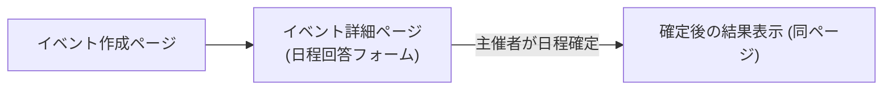

# **複数日程調整アプリ プロジェクト仕様書**

# **1. プロジェクト概要と目的（AI 駆動の開発方針）**

プロジェクト概要: 本プロジェクトは、主催者が複数の候補日程を提示し、参加者が各日程の都合（出席可能か否か）を回答することで、全員のスケジュールを調整し最適な日程を決定する Web アプリケーションです。バンドの練習日程調整やゲームの開催日決定など、複数日程候補から最適な日を決めたいユースケースを対象としています。既存の「調整さん」や「Doodle」のような日程調整サービスに近い機能を、Next.js と Supabase を活用して個人開発で実現します。

目的: グループでのイベント調整を円滑にし、無駄なやり取りを減らすことが目的です。主催者はリンクを共有するだけで参加者の都合を収集でき、参加者もログイン不要で回答できます。最終的な決定日程の通知や各自のカレンダーへの登録も簡易に行えるようにします。また、将来的に必要であれば LINE 通知なども検討します。

AI 駆動の開発方針: 本プロジェクトは要件定義から実装・テストに至るまで、ChatGPT や GitHub Copilot などの生成 AI を積極的に活用して進めます。具体的には、要件の整理や仕様書のドラフト作成に ChatGPT を利用し、コーディング時には Copilot の提案を取り入れて開発スピードを向上させます。ソロ開発でも AI をペアプログラマのように用いることで、一気通貫の迅速な開発を目指します。AI の生成するコードや回答は必ず人間がレビューし、整合性やセキュリティを確認しながら進めます。例えば、本仕様書自体も ChatGPT の協力を得て作成しており、人間による推敲と加筆で精度と一貫性を確保しています。また、JsDoc や TypeScript の型定義を活用し、AI が生成したコードの品質を向上させる工夫も行います。

技術スタック: 開発には Next.js 13 の App Router 機能を用い（React 18 の Server Components 対応）、サーバーサイドでのデータ処理に Server Actions（"use server"ディレクティブ）を活用します。フロントエンドのスタイリングには Tailwind CSS をベースに、そのコンポーネントライブラリである DaisyUI を使用します。DaisyUI を使うことで「Faster, cleaner, easier Tailwind CSS development」とあるように、セマンティックなクラス名で迅速な UI 構築が可能です 。バックエンドには Supabase を利用し、PostgreSQL データベースと認証・ストレージ基盤を提供します。Supabase は Firebase ライクな使い勝手で、オープンソースの BaaS として開発効率を高めます。加えて、Supabase の**Row Level Security (RLS)**機能により、クライアントから直接データベースを操作する場合でもセキュリティを確保できます 。本プロジェクトでは原則としてデータベース操作は Next.js サーバー経由で行いますが、RLS を有効にしておくことで万一フロントエンドから Supabase にアクセスする場合も安全性を担保します。

AI による補助: 開発中は ChatGPT を用いたコードスニペットの生成、エラーメッセージの分析、テストケースの案出なども行います。これにより一人でも複数人分の生産性を発揮し、短期間でのプロトタイプ完成を目指します。以上の体制で、本アプリケーションの設計・実装を効率よく進めていきます。

# **2. ユーザー種別とフロー（主催者／参加者／ゲスト）**

本アプリの想定ユーザーは、大きく主催者（イベントの作成者）と参加者（イベントに招待され日程の可否を回答する人）に分かれます。参加者についてはアカウント登録不要で回答できるゲストとして扱い、リンクを知っている人であれば誰でも参加可能な形とします（必要に応じて主催者がリンクを限定共有する運用です）。それぞれの役割ごとの利用フローは以下の通りです。

- 主催者 (Organizer): イベント（例: 練習日程調整）の発起人です。主催者はアプリ上で新規イベントを作成し、タイトルや説明、複数の候補日程を登録します。候補日程を入力後、「イベント作成」ボタンを押すとイベントが作成され、固有のイベントリンク（参加者共有用の公開 URL）と管理用の秘密 URL が生成されます。主催者はこの公開リンクを参加者に共有します（LINE やメールなど手段は任意）。参加者の回答状況は主催者用画面でリアルタイムまたは手動更新で確認できます。十分な回答が集まったら、主催者は回答結果を踏まえて最終日程を選択し、「日程確定」操作を行います。確定後は、参加者に結果を伝達します（本アプリから自動通知する機能は当初ありませんが、主催者が LINE やメールでリンクを再共有して知らせる想定です）。主催者は確定した日程を Google カレンダーや iCal (.ics)にエクスポートすることもできます。
- 参加者 (Participant): イベントに招待されたユーザーです。参加者は主催者から共有されたイベントの公開リンク（URL）にアクセスし、イベント詳細ページで候補日程一覧を確認します。参加者はログインや登録をする必要はなく、アクセス後そのまま自身の名前（またはニックネーム）と各日程の参加可否を入力できます。UI 上で各候補日に対し「◯」「×」等で出欠回答し、フォームを送信すると、自分の希望が登録されます。送信後、画面上に自分の回答が反映され、他の参加者の希望状況（集計）も確認できます（例えば各日程ごとの ○ 人数など）。参加者は後で再度同じリンクにアクセスし、自分の名前に紐づく回答を更新することも可能です（※同じブラウザでアクセスした場合は、自分の前回入力内容を保持・編集できるよう検討）。最終的に主催者が日程を確定すると、参加者はそのイベントページで確定した日程を知ることができ、自身のカレンダーに登録したり予定を空けたりします。
- ゲスト (Guest): 本アプリでは参加者は全てゲスト扱い（未登録ユーザー）となるため、厳密には参加者＝ゲストです。ここでの「ゲスト」は、主催者から正式に招待されたわけではない第三者もリンクさえ知っていれば回答できる点を指します。例えば主催者が公開リンクを想定外の人に転送した場合でも、その人はゲスト参加者として回答可能です。とはいえ通常は主催者が共有したメンバーのみがアクセスする前提です。ゲストに特有の画面はなく、参加者と同じフローで候補日程の回答を行います。将来的にログイン機能を導入し、参加者をユーザー登録制にした場合に「ゲスト」と「登録ユーザー」を分ける可能性はありますが、初期バージョンではすべてゲスト対応でシンプルに進めます。

フロー補足: 主催者と参加者で利用する画面自体は（後述するように）同一のイベントページですが、主催者には管理操作 UI（確定ボタン等）が追加表示されます。参加者（ゲスト）には管理 UI は表示されず、自身の回答入力のみ行える形です。また、現時点で LINE 等外部サービスとの連携機能は実装しませんが、主催者・参加者が手動で通知や共有を行う際に不便のないよう、イベントページ上に「リンクをコピー」ボタンを設けるなどの配慮をします。アクセシビリティ（A11y）と多言語対応（i18n）に関しては優先度が低いため、例えばスクリーンリーダー向けの詳細な調整や他言語 UI は当面行いません。ただし基本的なフォームラベルの設定など最低限のアクセシビリティは確保し、日本語 UI で実装します（必要に応じて将来的な対応は可能）。

# **3. 機能一覧と優先度マトリクス**

本アプリに盛り込む機能を洗い出し、重要度と実装優先度に基づいて分類します。MVP（実用最小限）として必須の機能と、将来的な拡張機能に分け、開発の指針とします。

**◎ 必須機能（高優先度 / MVP）**

- イベント作成機能: 主催者がイベントタイトル、説明文（任意）、候補日程（複数）を入力して新規イベントを作成できます。作成時にイベント固有の公開 URL（参加者回答用）と管理用 URL が発行されます。
- 候補日程の登録: 日付または日時を複数追加・削除できる UI。最低 1 つ以上の候補日程を入力必須。
- 公開リンク共有: 作成後に表示されるイベント公開リンクをコピーして参加者に共有可能。参加者はこのリンクからイベント詳細ページにアクセスできます。
- 参加者の回答機能: 参加者がイベントページ上で自分の名前を入力し、各候補日に対して参加可能かどうかを回答できます（UI 上はチェックボックスや ○× 選択等で実装）。回答はサーバー経由で即時に DB へ保存されます。回答送信後は入力フォームを非表示とし、成功メッセージを表示します。必要に応じて「別の名前で回答する」オプションを提供することで、新たな回答も可能にします。
- 回答 UI は、期間中の各時間帯（例：15 分単位）に対して、「空き／不可」の可否をマス目形式で入力できるインターフェースとする。参加者は 1 日単位・時間帯単位で複数ブロックを選択できる。
  - なおこの時間帯の単位はイベント作成時に設定する
- 表示形式は 2 種：
  - **リスト形式**：時間帯ごとの空き人数を一覧で表示
  - **ヒートマップ形式**：日付 × 時間帯の表形式で空き状況を色の濃淡で可視化
  - 利用者は UI 上で表示形式を切り替えることが可能
- 回答状況の集計表示: イベントページにて、現在の各候補日の「○ 人数/× 人数」や、各参加者ごとの回答状況一覧をリアルタイムまたはページ再読み込みにより確認できます。主催者・参加者ともに他の人の回答状況を見て、自分の予定調整に役立てられます。
- 日程の最終確定機能: 主催者は 1 つ以上の時間帯（連続・非連続）を選択し、イベント日程として確定できます。これにより、複数の枠（例：10:00-11:00, 15:00-16:00）をまとめて確定することが可能になります。なお確定操作が行われても、参加者は回答の編集が可能です。
- 確定結果の表示: イベントページ上で、確定した日程を全ユーザーに明示します（例：「○ 月 ○ 日に決定しました」等）。確定した日程に出席可能と回答した参加者のリストも表示します。
- カレンダー連携（エクスポート）: 確定日程を各自のカレンダーアプリに追加できるよう、iCalendar 形式のファイル（.ics）ダウンロードリンクおよび Google カレンダーに予定追加するためのリンクを提供します。.ics ファイルにはイベント名・日時・説明が含まれ、Google カレンダーリンクではタイトル・日時・詳細が自動入力された Google カレンダーの予定作成画面を開けます。
- レスポンシブ対応: PC・スマートフォンの両方で使いやすいように、画面レイアウトをレスポンシブデザインで構築します（Tailwind CSS のユーティリティで実装）。モバイル端末でも回答しやすい UI 配置にします。

**○ 任意機能（中優先度 / 将来検討）**

- 参加者の回答編集: 参加者が一度送信した自分の回答を後から修正できる機能。本仕様では同じブラウザから再訪問時に前回入力した名前を記憶し、同名回答があれば上書き更新する形で対応予定ですが、将来的には回答時に発行する参加者用トークンやクッキーで本人を識別し、編集用インターフェースを提供することも検討します。
- イベント情報の編集（主催者）: イベント作成後に主催者が候補日程や説明文を変更・追加できる機能。初期版では対応しませんが、日程候補の追加や誤入力修正のニーズがあるため、将来的な改善項目です。
- 通知機能 (LINE 連携): 日程確定時に参加者へ自動通知する機能。例えば LINE Notify を使い、主催者のアカウントから参加者の LINE にメッセージを送る仕組みなどが考えられます。現時点では未対応ですが、もし無料かつ利用制限なく実現できる方法（※LINE Notify はユーザー自身のアクセストークンを使えば無料で一定数メッセージ送信可能）があれば、今後導入を検討します。
- イベント一覧/管理ダッシュボード: 主催者向けに、自分が作成したイベントの一覧を表示し管理できる画面。個人利用が前提のため当面は不要ですが、ログイン機能を導入した場合やイベント件数が増えた場合には検討します。
- リアルタイム更新: 参加者の回答が追加された際に、他のユーザーの画面に即座に反映されるようリアルタイム通信（Supabase の Realtime 機能や WebSocket 利用）を行うこと。MVP 段階ではページ再読み込みやフォーム送信後のサーバー再レンダリングで十分としますが、UX 向上のため余裕があれば導入を検討します。
- 多言語対応: 日本語以外の言語で利用できるようにすること。本プロジェクトでは対象ユーザーが日本語話者と想定されるため優先度低ですが、将来的に英語対応を行う可能性もあります。
- 軽微なアクセシビリティ改善: キーボード操作だけで回答送信できる工夫や、色覚バリアフリー対応など。深刻な問題がない範囲で一旦リリースし、必要に応じて改善します。

**△ 実装しない機能（低優先度 / 当面不要）**

- 外部コラボレーションツール連携: Slack 通知や Google Meet 自動生成など、他の外部 API との連携は行いません。チーム向け日程調整では Slack 連携が考えられますが、本アプリのスコープ外です。
- 高度な認証・ユーザー管理: ゲスト参加形式で十分なため、ユーザー登録や認証（OAuth ログイン等）は当面実装しません。必要になれば Supabase Auth を有効化してメール認証等を導入できますが、MVP では省きます。
- 課金・プロプラン対応: 個人利用を想定しており、現状で有料プランや大規模ユーザー対応は不要です。そのためクレジットカード情報の取扱いや課金システム等は考慮しません。
- 複雑な繰り返しイベント設定: 毎週特定曜日に繰り返すイベントなどの設定はサポートしません（各回ごとにイベントを作成する運用）。将来的に必要になれば RRULE のサポート等を検討しますが、まずは単一決定イベントのみ扱います。

上記のように、まずは候補日程の提示～最終決定～カレンダー登録までの一連の流れに必要な機能に絞って実装します。その上で、時間と要望に余裕があれば任意機能に着手する方針です。

# **4. 画面遷移図とページ構成**

本章では、主要な画面の構成要素と遷移フローを記載します。本アプリは画面数が多くないため、シンプルな遷移図になります。



上記のように、主催者の「イベント作成ページ」(A)から始まり、イベントが生成された後はそのイベント詳細ページ(B)に移動します。参加者は共有された B にアクセスして回答し、主催者も同じページで集計を確認・最終決定します。確定操作後も URL は同じで、ページ内容が「確定結果表示」(C)に変化するイメージです。

各ページの具体的な構成要素は以下の通りです。

- イベント作成ページ (Home/Create Event): 主催者が最初に訪れる画面です。ここでは新規イベントの情報入力フォームを表示します。主要要素:
  - ページタイトル：「新規イベント作成」
  - イベントタイトル入力欄（text）※必須
  - イベント説明入力欄（textarea）※任意
  - 候補日程設定セクション：
    - 候補日程の指定方式は「開始日」と「終了日」を選択し、その期間内の時間帯（30 分または 60 分単位,120 分,custom など）をマス形式で生成。主催者はその中で有効な時間帯を指定してイベントの範囲とする。
    - 除外日の設定：期間内で候補から外したい日付を追加できる機能
    - 「除外日を追加」ボタンで特定の日を候補から外すことが可能
    - 候補日程プレビュー機能（何日間の候補があるか表示）
  - 「イベントを作成」送信ボタン（フォームを Server Action にポスト）
  - （UI）Tailwind+DaisyUI でフォームを整形し、項目ごとに<label>を付与します。
- 入力検証として、タイトルと少なくとも 1 つの日程が入力されていることをチェックします（ブラウザの必須属性とサーバー側の双方で確認）。送信成功後、このページはイベント詳細ページへリダイレクトします。
- イベント詳細ページ (Event Detail / Poll Page): 主催者がイベント作成後に遷移するページ、また参加者が公開リンクからアクセスするページです。URL は/event/[公開トークン]形式で、ページを開くとサーバーサイドで該当トークンのイベント情報を読み込み表示します。主要要素:

  - イベントタイトル（大見出し）と説明文（あれば表示）。
  - 「回答フォーム」セクション（参加者向け入力フォーム）:
    - 名前入力欄（text、参加者が自分の名称を記入。記名式とする）
    - 候補日程一覧と回答入力:
      - 各日程ごとに 1 行ずつ、日付/時間の表示＋回答入力 UI。
      - 回答 UI はチェックボックス（✔=参加可能）とし、チェックあり＝「参加可」、チェックなし＝「不可」と解釈します。もしくは ○× ボタンをトグル選択できる UI でも良いでしょう。シンプルさ優先でチェックボックス形式を採用します。
      - 日程が多数の場合はスクロール可能なリストにします。
    -
    - 「送信」ボタン（参加者はこれを押して自分の回答を登録）。
  -
  - 「回答状況の集計表示」セクション:
    - 送信後、または既に他の人の回答がある場合、イベントの集計結果をテーブル形式で表示します。
    - 例えば、横軸に候補日程、縦軸に参加者名のグリッド表を表示し、各交点に ○× をマークする形です。回答者が多い場合は縦方向にスクロールできます。
    - または単純に各日程ごとの ○ 人数・× 人数を一覧表示する形でも構いません。可能であれば両方提供しますが、初期版では実装容易な各日程の可人数集計を表示します。
    - この集計はサーバーから取得した最新データで表示し、参加者がページを開いたときや自分の送信後に最新状況がわかるようにします。
  -
  - 主催者用機能 UI: このページを主催者（管理者権限）として開いている場合のみ表示されます。
  - 管理用アクセスは常にクエリパラメータ方式のみとし、URL は

  ```

  /event/[公開トークン]?admin=[管理トークン]
  ```

  - 「最終日程の確定」ボタン/セレクタ: ユーザは集計結果を見て、開催日として適切な候補を選びます。各候補日の横に「この日に決定」ボタンを設けるか、候補を選択して「確定」ボタンを押す UI とします。
  - 誤操作防止のため確認ダイアログを出し、「これらの日程を確定する」旨を知らせます。
  - なお、確定操作は後でも変更可能とする。
  - サブルート `/admin/[token]` は廃止。
  -
  - ページのフッター: 利用上の注意（「このリンクを知っている人なら誰でも回答できます」など）や著作権表示。

- 参加者が「送信」ボタンを押すと、サーバーに回答内容が送信されデータベースが更新されます。サーバー処理後、ページは再読み込みされ最新の集計が表示されます（後述の Server Actions を使用）。主催者がアクセスしている場合、随時 F5 などで他参加者の最新回答を確認できます（将来的には自動更新）。
- 確定結果表示（Final Result State）: 主催者が最終日程を確定すると、同じイベント詳細ページの内容が以下のように変化します。
  - 「回答フォーム」セクションに確定日が表示されるようになります。
  - （参加者はこれ以降も回答可能とする）。
  - 集計表示の上部に「イベント日程が確定しました: ○ 月 ○ 日（曜日）」等の目立つ表示を追加します。
  - その下に「出席予定の参加者: ○○ さん、△△ さん…」と、確定日程に参加可能と回答していたメンバーの名前一覧を表示します（不参加の人は表示省略）。
  - カレンダー追加のオプション提供: 確定したイベントを各自のカレンダーに登録できるよう、以下の要素を配置します:
    - 「カレンダーに追加」ボタン（クリックで .ics ファイルをダウンロード。拡張子.ics のカレンダーファイルを生成するサーバーサイドエンドポイントに誘導）
    - 「Google カレンダーで開く」リンク（Google Calendar のイベント作成画面を直接開くリンク。詳細は後述）。
    - これらの UI には確定した日時・イベント名の情報が埋め込まれます。
  -
  - 「イベントを終了しました」といったメッセージや、必要であれば「イベント削除」ボタン（データベースからイベントを削除してリンクを無効化する機能、ただし初期版ではなくても良い）を配置します。

なお、主催者がイベント作成直後に遷移する際は、URL に管理用トークンが含まれる特別なリンク（例えば/event/公開 ID?admin=管理トークンや/event/admin/[管理トークン]）でアクセスします。その場合、自動的に上記の主催者用機能 UI が有効になります。参加者が通常の公開 URL でアクセスした場合は管理 UI は表示されません。

画面遷移としては非常にシンプルで、作成 → 詳細(回答/確定)の 2 画面（状態）構成です。ユーザーはリンクのやり取りのみで完結でき、ナビゲーションメニューなども最小限にします（トップページ＝作成ページ程度）。初期実装ではトップページにいきなり作成フォームを置きますが、必要ならトップに簡単な紹介文を入れ、メニューに「新規イベント作成」「イベントを見る」（＝リンクから遷移してくる）程度を配置する想定です。

# **5. ディレクトリ構成とコーディング規約**

Next.js（App Router）プロジェクトの標準に従い、コードの配置と命名規則を定めます。また、チーム開発ではありませんがコード品質を保つため Lint や Formatter も導入します。

プロジェクト構成:

```
project-root/  # 実際のプロジェクトルート
├── src/                      # ソースコードのルートディレクトリ
│   ├── app/                  # Next.jsのApp Routerディレクトリ
│   │   ├── layout.tsx        # 全体レイアウト
│   │   ├── page.tsx          # ホーム（LP）
│   │   ├── actions.ts        # Server Actions関数
│   │   ├── event/
│   │   │   ├── new/
│   │   │   │   ├── page.tsx  #イベント作成ページ
│   │   │   ├── [public_id]/
│   │   │   │   ├── page.tsx  # イベント詳細ページ, 公開＆管理UIともにここで制御
│   │
│   │   └── api/
│   │       └── generate-ics/
│   │           └── route.ts
│   │
│   ├── components/           # 再利用可能なコンポーネント
│   │   ├── event-form.tsx    # イベント作成フォームコンポーネント
│   │   ├── availability-form.tsx  # 参加可否入力フォーム
│   │   ├── availability-summary.tsx  # 集計表示用コンポーネント
│   │   ├── date-range-picker.tsx  # 日程期間選択コンポーネント
│   │   └── ...
│   │
│   └── lib/                  # ユーティリティ関数など
│       ├── supabase.ts       # Supabaseクライアント初期化
│       └── actions.ts        # Server Actions実装
│
├── public/                   # 静的ファイル
├── supabase/                 # Supabase関連設定(migrations等)
│   └── migrations/           # DBマイグレーションファイル
├── .env.local                # 環境変数（Git管理外）
├── next.config.ts
├── tailwind.config.js
└── ...
```

````

- Next.js App Router では app/以下にページを配置します。今回はシンプルなので page.tsx（ホーム）と event/[public_id]/page.tsx 程度です。管理用のページはクエリパラメータで処理しても良いですが、セキュリティ上わかりやすく分けるため admin/[admin_token]サブルートとして用意しています。この admin_token ページは管理者権限のチェックと専用 UI の表示を行います。
- 静的ファイルは public/ディレクトリ以下（今回は大きな静的アセットは想定なし、ロゴ画像程度）。
- コンポーネントは UI 部品ごとに components/ディレクトリに配置し、ファイル名は kebab-case（ハイフンつなぎ小文字）で統一します。たとえば EventForm コンポーネントは event-form.tsx ファイルに定義します。React コンポーネントの関数名（型名）は PascalCase で書きますが、ファイルシステム上は大文字小文字の違いによる不具合を避けるため全て小文字ファイル名とします。
- ビジネスロジックや設定値をまとめる場所として lib/ディレクトリを用意します。ここに Supabase との接続クライアント初期化やユーティリティ関数、型定義などを置き、ページやコンポーネントからインポートして使います。

コーディング規約:

- 言語/フレームワーク: TypeScript を使用し、型安全なコードを書きます（Supabase の型は自動生成 or 手動定義）。React は関数コンポーネント＋フックで記述し、状態管理は必要最低限に抑えます（基本サーバーでデータ処理するためクライアント側状態はフォーム入力ぐらい）。
- 命名: ファイル・フォルダ名は前述のように kebab-case（例: availability-table.tsx）。変数や関数は JavaScript 標準の camelCase、クラス名は PascalCase、定数は UPPER_SNAKE_CASE。SQL のテーブル・カラム名もスネークケースで記述します。
- コードフォーマット: Prettier を導入し、セミコロンやホワイトスペースなどスタイル統一を自動化します。コミット前に Prettier でフォーマットをかけ、diff が極力スタイル差分で汚れないようにします。文字列引用符や末尾カンマの有無などは Prettier 既定に従います。
- Lint: ESLint（Next.js 付属のもの）を有効化し、明らかなバグやアンチパターンを検出します。ルールセットは Next.js 標準 + 推奨（必要に応じて Airbnb スタイルガイド等）を適用します。TypeScript の strict モードも有効にします。
- コミット運用: 本プロジェクトは個人開発ですが、なるべく小さな論理単位でコミットし、コミットメッセージもわかりやすく記述します。ツールとしては lint-staged や husky を用いてコミット前に lint/format を自動実行する設定を検討します。
- CSS 設計: スタイルは Tailwind CSS のユーティリティクラスを直接 JSX 内に記述します。重複するスタイルはカスタムクラスを定義するよりも、DaisyUI のコンポーネントクラスを活用して記述量を削減します。例えばボタンのスタイルに関しては<button className="btn btn-primary">のように DaisyUI 提供のクラスを使用します（DaisyUI のセマンティックなクラス名で迅速に構築 ）。追加のカスタム CSS が必要な場合のみ globals.css に記述します（Tailwind の@apply ディレクティブで共通デザイン適用など）。

以上の規約に従い、読みやすく保守しやすいコードを心がけます。特に AI 補助で生成したコードについても Lint/Format で整形し、人間が理解しやすい変数名・構造になるよう適宜リファクタします。

---

### 5.1 コミット運用ルール

1. **コミット粒度・頻度**
   - なるべく小さな論理単位（機能追加／バグ修正ごと）でこまめにコミットする。
   - 一つのコミットに複数の機能を混在させない。
2. **コミットメッセージ書式**

   - **フォーマット例**

     ```
     <type>(<scope>): <短い要約>

     <詳細説明>

     ```

   - **type**（必須、コミットの種別を表す）
     - `feat`：新機能
     - `fix`：バグ修正
     - `docs`：ドキュメントのみの変更
     - `style`：フォーマットやセミコロン追加などコード動作に影響しない変更
     - `refactor`：リファクタリング
     - `test`：テストの追加・修正
     - `chore`：ビルドプロセスや補助ツールの変更
   - **scope**（任意、影響範囲を表す）

     例：`event-form`、`api/generate-ics`

   - **要約（subject）**：50 文字以内を目安に、命令形で端的に記述
   - **本文（body）**：必要に応じて「なぜこの変更が必要か」「どのように確認するか」等を記載

3. **コミット前の自動チェック**
   - `lint-staged`＋`husky`を使い、コミット直前に Prettier／ESLint を自動実行する設定を必須とする citeturn1file0。
   - フォーマットエラーや静的解析エラーが残ったままコミットを禁止する。

---

### 5.2 プルリクエスト運用ルール

1. **ブランチ戦略（Git Flow をベース）**
   - **主開発ブランチ**：`develop`
   - **リリース用ブランチ**：`release/x.y.z`
   - **ホットフィックス用ブランチ**：`hotfix/x.y.z`
   - **新機能／修正用ブランチ**：`feature/<短い説明>`、`bugfix/<短い説明>` など
2. **プルリクエスト作成時の命名規則**
   - タイトルは `[<type>] <ブランチ名>: <要約>` 形式を推奨
     - 例：`[feat] feature/event-form: 複数日程追加UIの実装`
3. **PR 本文テンプレート**
   - **背景・目的**（Why）
   - **変更内容**（What）
   - **動作確認手順**（How to test）
   - **関連 Issue／チケット**（If any）
   - **チェックリスト**
     - [ ] コミットメッセージ規約に準拠
     - [ ] 自動整形／Lint 通過済み
     - [ ] 単体テスト・結合テストがパス
     - [ ] スクリーンショット／GIF（UI 変更がある場合）
4. **レビュー要件**
   - **承認者**：最低 1 名以上のレビュー＆承認を必須とする
   - **CI 結果**：すべての自動チェック（Lint／ビルド／テスト）がパスしていること
5. **マージ方法**
   - 承認・CI 通過後は **Squash and merge** を原則とし、マージコミットや不要な履歴を整理
   - リリース準備時は `release` ブランチでマージし、タグ付けを行う
6. **WIP／ドラフト PR**
   - 作業中はプルリクエストを **Draft** に設定し、レビュー依頼前に「Ready for review」へ切り替える

---

以上のルールを守ることで、高頻度かつ一貫性のある Git 運用を実現し、コード品質とチーム内コミュニケーションの円滑化を図ります。

# **6. Supabase DB 設計（テーブル、リレーション、トークン設計）**

データベースは Supabase 上の PostgreSQL を使用します。テーブル構造とリレーション、および外部からのアクセス制御（トークン、RLS ポリシー）について設計します。重要: Supabase では**Row Level Security (RLS)**を有効化し、匿名アクセスでも不正なデータ参照や改ざんができないようにします。匿名ユーザー用の anon キーは RLS を組み合わせることでフロントエンドから使っても安全であり 、サーバーサイドではより権限の高い service_role キーを使用してバックエンド処理を行います（サービスキーは RLS を無視できるためブラウザには絶対露出させません ）。

主なテーブル:

1. events（イベント）
   - id (UUID, プライマリキー): イベントを一意に識別する ID。uuid_generate_v4()により自動生成します。これは内部 ID であり、公開用の ID とは別に持ちます。
   - public_token (UUID, ユニーク): イベント公開用トークン。参加者への URL に使用します。基本的には id と同値でも良いのですが、将来的に URL を短縮するなどの目的で別フィールドにしています。初期実装では public_token も uuid を生成し、URL に埋め込みます（推測困難な長い文字列）。
   - admin_token (UUID, ユニーク): イベント管理用トークン。主催者のみが知る秘密の識別子で、管理者権限の操作に使用します。イベント作成時に別途 UUID を発行します。このトークンは公開 URL には含めず、主催者にのみ表示される管理 URL に含めます。
   - title (text): イベントのタイトル。
   - description (text): イベント説明文（任意項目なので NULL 可）。
   - is_finalized (boolean, デフォルト false): イベントが日程確定済みかを示すフラグ。一度 true になったら変更しません。
   - final_date_id (UUID, 外部キー events_dates.id, NULL 可): 確定した日程の ID。未確定時は NULL、確定時に選ばれた event_dates の ID をセットします。
   - created_at (timestamp, default now()): 作成日時。
   - created_by (UUID, 外部キー auth.users.id, NULL 可): イベントを作成したユーザー ID。今回は認証なしのため NULL ですが、将来 Supabase Auth のユーザー ID を紐付けることを想定してフィールドだけ用意します。
3. event_dates（イベント候補日程）

   - id (UUID, PK): 候補日程の ID。
   - event_id (UUID, 外部キー references events.id on delete cascade): 所属するイベントの ID。親イベントが削除されたら候補も削除。
   - start_time timestamp NOT NULL, end_time timestamp NOT NULL: 候補。タイムゾーンは UTC に統一し、また実装簡易化のため、表示時などにもタイムゾーンは考慮しない処理にする。
     例）`      const dateKey = [
  start.getFullYear(),
  String(start.getMonth() + 1).padStart(2, "0"),
  String(start.getDate()).padStart(2, "0"),
].join("-");`

   > 候補日程は「日時」ではなく「時間帯」として管理され、各レコードは開始時刻 (start_time) と終了時刻 (end_time) の範囲を持つ構成とします。例：2024-04-02 10:00 ～ 2024-04-02 11:00

   - label (text, NULL 可): 日程の補足ラベル。例えば「予備日」等任意の名称を付けたい場合用。通常は NULL で日時がそのまま表示されます。
   - created_at (timestamp): 作成日時。

4.
5. participants（参加者）
   - id (UUID, PK): 参加者の ID。
   - event_id (UUID, 外部キー references events.id on delete cascade): 紐づくイベント ID。
   - name (text): 参加者名。ログインなしのため自由入力文字列です。同じイベント内ではユニークであることが望ましいですが、強制はしません（ただし重複名があると区別できなくなるため、UI 上注意喚起）。
   - response_token (UUID, ユニーク, NULL 可): 参加者個別の回答編集用トークン。現時点未使用ですが、将来的に参加者が後で自分の回答を編集できるようにする際に利用します。回答送信時に生成し、クッキーや LocalStorage に保存しておくことで本人確認に用います。
   - created_at (timestamp): 作成日時（=回答送信日時）。
6.
7. availabilities（出欠回答）
   - id (UUID, PK): 出欠レコード ID。
   - event_id (UUID, 外部キー references events.id on delete cascade): 紐づくイベント ID。（正規化のため participant や event_dates から導出できますが、検索効率向上のため保持）
   - participant_id (UUID, 外部キー references participants.id on delete cascade): 回答者 ID。
   - event_date_id (UUID, 外部キー references event_dates.id on delete cascade): 対象候補日程 ID。
   - availability (boolean): 参加可否。true=参加可能(○)、false=不可能(×)。
   - created_at (timestamp): レコード作成日時。
8. 設計補足: availabilities は各参加者・各日程の組み合わせごとにレコードを持ちます。例えばイベントに 3 つ候補日があれば、1 人の参加者につき最大 3 件の出欠レコードができます（全て入力した場合）。この構造により、参加者が未回答の日程はレコードが存在しないことで判別可能ですが、通常 UI では全候補に対し必ず ○ か × を選んでもらう運用とします。したがって回答送信時には全候補日程について availabilities レコードを作成します（○ は true、× は false）。この正規化により集計クエリは簡潔になります。

テーブル間のリレーション:

- events 1 - n event_dates
- events 1 - n participants
- events 1 - n availabilities
- participants 1 - n availabilities
- event_dates 1 - n availabilities

主キー・外部キー制約に加え、以下のような制約/インデックスも設定します:

- participants テーブルで(event_id, name)にユニークインデックス（同一イベントで同名が重複しないよう一応設定。ただし厳密にはスペース違いや全角半角違いなどは区別されるため完全には防げません）。
- availabilities テーブルで participant_id, event_date_id の組にユニーク制約（同一参加者の同一日程に重複回答がないように）。もしくはこれら複合を主キーにしても良いですが、一応 id を主キーにしています。
- event_dates テーブルに(event_id, date_time)でインデックス（同一イベント内で重複日時があればユニークにしてもよいですが、ここでは制約しません）。

RLS（Row Level Security）ポリシー設計:

Supabase ではテーブルごとに RLS を有効化し、匿名ユーザー（role=anon）や認証ユーザー（role=authenticated）に対するデータアクセス権限を細かく制御します。本アプリは基本的にサーバー上でサービスロール（service_role）を用いて DB 操作するため、直接クライアントからのリクエストは想定していません。しかし、万一 Supabase クライアント JS 経由でデータを読み書きする場面が出ても安全なよう、RLS を設定します。各テーブルについて、以下の方針でポリシーを定義します（擬似コード形式）:

- events テーブル:
  - 読み取り (SELECT): 公開トークンを知っている利用者にそのイベントを読ませる必要があります。実装としては、クエリ時に必ず public_token で絞り込む前提とし、ポリシーで using ( public_token = auth.jwt() ->> 'event_token' )のようにトークン一致を要求する方法が考えられます。ただし今回はサーバーサイドで service_role を使うため、クライアントから直接 SELECT はさせません。念のため「Anon ユーザーはデフォルトで SELECT 禁止」のポリシーを設定しておきます。主催者であっても匿名での DB 直接アクセスはしないため、基本閉じています。
  - 挿入 (INSERT): 匿名ユーザーが直接 events を作成することは無い（サーバー側で service_role が行う）ため、anon は許可不要。
  - 更新 (UPDATE)/削除 (DELETE): 同上で、クライアントからは許可しません（削除等もサーバーのみ）。
  - ※Supabase Auth ユーザーを使う場合は、created_by が自分の UID の場合のみ編集可などのポリシーを追加することになりますが、初期版では省略。
-
- event_dates テーブル:
  - SELECT: 関連する events のポリシーと同様、基本 anon には直接読ませない想定です。ただ、公開イベントの候補一覧を取得するケースはありえます（例えばクライアントで表示更新する場合）。その場合 event_id が指定された上で、そのイベントの public_token が一致する条件のみに限定します。これには Postgres 関数でイベントを参照するか、JOIN でイベントテーブルと紐付けた VIEW に対してポリシーを書く方法があります。簡易には「anon は SELECT 不可」にします。
  - INSERT/UPDATE/DELETE: anon 禁止（dates の操作は主催者のみで、サーバー経由実施）。
-
- participants テーブル:
  - SELECT: あるイベントに属する参加者一覧を読むには、そのイベントの public_token を知っている必要があります。こちらも events に基づく条件付き許可とします。例えば「using ( event_id IN (SELECT id FROM events WHERE public_token = auth.jwt() ->> 'event_token') )」のようなイメージです。簡略化するとあるイベントのトークンを持っている人はそのイベント参加者を読めるというポリシーです。
  - INSERT: 匿名ユーザーが自分の参加者レコードを登録する操作は許可します（RLS 的には「anon can insert if event_id のイベントが該当トークンのもの」）。ただしこれもサーバー経由で行うため、サーバー側では service_role で制限なく INSERT します。念のため、クライアント直の場合は上記 SELECT と同様 event_token 一致条件で INSERT 許可する方針です。
  - UPDATE/DELETE: 基本匿名には許可しません（自分の名前変更等も初期版は不可）。将来本人編集を許可するなら、自分の response_token を持つ場合のみ許可といった条件を追加します。
-
- availabilities テーブル:
  - SELECT: 参加者と同様、イベントのトークンが一致するデータのみ閲覧許可。具体的には JOIN 前提で、「イベントの public_token が要求トークンと一致する availabilities のみ SELECT 可」とするイメージです。Supabase では直接 JOIN 条件にポリシーは書けないため、サブクエリか VIEW で対応します。
  - INSERT: 匿名ユーザーが自分の回答を挿入することは許可します。その条件として「対応する event_id のイベントの public_token が要求トークンと一致し、かつ participant_id が自分のもの（該当イベントでまだ存在しないか自分の response_token を持つ）」をチェックします。やや複雑ですが、ここも server_role で処理するためシンプルに「anon は INSERT 不可」としても問題ありません。
  - UPDATE/DELETE: 匿名では許可しません。回答の修正は INSERT の上書きで対処し、不要な古い availabilities を消す処理はサーバー（または DB トリガ）で行います。
-

RLS ポリシーは上記方針で設定し、Supabase の Anon キーをフロントに埋め込んでも安全な状態にします。一方、Next.js サーバー上では Supabase のサービスキーを用いてこれらの制限をバイパスしつつ（サービスロールは RLS を無視できる管理権限 ）、アプリケーションロジック側で適切にトークンチェックを行います。

トークン設計とセキュリティ:

- public_token: 推測困難な UUID 値を使用します。URL 経由で広く共有されるため、この値を知っている人は誰でもそのイベントの情報取得・回答が可能です。したがって、第三者に漏れないようユーザーには注意を促します。万一漏洩してもイベント単位の被害に留まります。イベント終了後に削除するか、あるいは is_finalized 後に RLS で SELECT も禁止するなど、必要に応じ追加対策を取ります。
- admin_token: こちらも UUID を使用し、公開しない前提です。イベント作成直後に主催者にのみ表示します。万一他者に知られると勝手に日程確定等の操作をされる恐れがあります。現状、admin_token 自体にパスワード的な保護はありませんが、十分長いランダム文字列のため漏洩確率は低いです。主催者が管理用 URL を人に教えない限り問題ありません。将来的には主催者本人がログインしている場合にのみ確定操作を許可するなど、Auth と組み合わせた強化も可能です。

データ取得フロー補足: フロントエンドでは通常 Next.js のサーバー経由でデータを取得するため、ブラウザから直接 Supabase の Rest API が呼ばれることはありません。そのため、RLS の仕組みは最終防衛ラインとして働き、実際の権限チェックはサーバー上で行います。例えば参加者が回答を送信する場合、サーバーの処理関数が event_id や participant_id を検証し、他のイベントに書き込もうとしていないかなどチェックします。

スキーマ例:

- - events テーブル

create table events (

id uuid primary key default uuid_generate_v4(),

public_token uuid not null unique,

admin_token uuid not null unique,

title text not null,

description text,

is_finalized boolean not null default false,

final_date_id uuid references event_dates(id),

created_at timestamp not null default now(),

created_by uuid references auth.users(id)

);

alter table events enable row level security;

- - RLS ポリシーの例（疑似コード）:
- - allow select for anon if public_token matches JWT.claims.event_token
- - allow insert/update/delete for service_role only (no anon)
- - event_dates テーブル

create table event_dates (

id uuid primary key default uuid_generate_v4(),

event_id uuid not null references events(id) on delete cascade,

date_time timestamp not null,

label text,

created_at timestamp not null default now(),

constraint uniq_date_per_event unique(event_id, date_time)

);

alter table event_dates enable row level security;

- - RLS: select/modify allowed only via server_role or with valid event_token as context.
- - participants テーブル

create table participants (

id uuid primary key default uuid_generate_v4(),

event_id uuid not null references events(id) on delete cascade,

name text not null,

response_token uuid,

created_at timestamp not null default now(),

constraint uniq_name_per_event unique(event_id, name)

);

alter table participants enable row level security;

- - RLS: allow anon insert if event_id's public_token = provided token;
- - allow select for anon if matching event_token; no update/delete by anon.
- - availabilities テーブル

create table availabilities (

id uuid primary key default uuid_generate_v4(),

event_id uuid not null references events(id) on delete cascade,

participant_id uuid not null references participants(id) on delete cascade,

event_date_id uuid not null references event_dates(id) on delete cascade,

availability boolean not null,

created_at timestamp not null default now(),

constraint uniq_availability unique(participant_id, event_date_id)

);

create index idx_avail_event ON availabilities(event_id);

alter table availabilities enable row level security;

- - RLS: allow select for anon if event_id's public_token matches;
- - allow insert for anon if matching event token and valid participant; no anon updates.

（実際のポリシー記法は Supabase のドキュメントに従い定義します。）

以上がデータベース設計です。Supabase コンソールからこれらテーブルを作成し、SQL エディタでポリシーを設定します。ポイント: 全テーブルで RLS を有効にすることで、Anon キーをフロントに埋め込んでも基本的に認可された操作以外はできません 。サーバーでは必要に応じ service_role キーを使い RLS をバイパスして操作しますが、このキーは環境変数で管理し公開しません 。

# **7. サーバ関数（use server）による処理フローと型付き I/O 例**

Next.js の Server Actions（React 18 のサーバーコンポーネント機能）を用いて、フォームからのデータ送信を直接サーバーで処理し、データベース操作を行います。これにより、追加の API エンドポイントやクライアント側での fetch 処理を記述する必要がなく、シンプルな構成で実装できます。

Server Actions の仕組み:

"use server"ディレクティブを付与した非同期関数をコンポーネント内（もしくは別モジュール）で定義し、フォーム要素の action 属性にその関数を指定することで、フォーム送信時にその関数がサーバー側で実行されます。実行された関数内でデータベースの読み書きを行い、必要な値を返すか、ページをリダイレクト/再検証 (revalidate) します。これにより、伝統的な REST API を経由することなくフォーム送信 →DB 処理 →UI 更新が完結します。

主なサーバーアクションと処理フロー:

1. イベント作成アクション (createEvent):
   対応フォーム: イベント作成ページのフォーム (action={createEvent}).
   処理フロー: - 入力: フォームの内容（タイトル、説明、候補日程リスト）。Next.js はフォームの各フィールドを収集し FormData オブジェクトとしてサーバー関数に渡します。型安全に扱うため、まず FormData から各値を読み取り、TypeScript 上で NewEventInput 型などにパースします。 - トークン発行: admin_token と public_token 用に UUID を 2 つ生成します。生成には Node.js で crypto.randomUUID()を使うか、Postgres 側で uuid_generate_v4()させるかのいずれかです。ここでは後段の INSERT 文で DB 側生成機能を使います。 - データベース処理: Supabase クライアント（サーバー用）を使用し、トランザクション的にイベントと候補日程を保存します。疑似コード:
2.

'use server';

import { createClient } from '@supabase/supabase-js';

import { Database } from '@/lib/database.types'; // 事前に生成した型

const supabaseAdmin = createClient<Database>(process.env.SUPABASE_URL!, process.env.SUPABASE_SERVICE_ROLE_KEY!);

interface NewEventInput {

title: string;

description?: string;

dates: string[]; // ISO 文字列 or 'YYYY-MM-DD'形式

}

export async function createEvent(formData: FormData) {

const title = formData.get('title') as string;

const description = formData.get('description') as string | null;

const dates = formData.getAll('dates'); // 複数日程フィールド（name="dates"）を取得

// バリデーション

if (!title || dates.length === 0) {

throw new Error('必要項目が未入力です');

}

// DB 挿入

const { data: eventData, error } = await supabaseAdmin.from('events')

.insert({

title,

description,

// public_token/admin_token は DB 側 default で uuid 生成 or ここで UUID 生成して渡す

})

.select('id, public_token, admin_token');

if (error || !eventData) {

console.error(error);

throw new Error('イベント作成に失敗しました');

}

const newEvent = eventData[0];

// event_dates 挿入

const dateRows = dates.map(dateStr => ({ event_id: newEvent.id, date_time: new Date(dateStr) }));

const { error: dateError } = await supabaseAdmin.from('event_dates').insert(dateRows);

if (dateError) {

console.error(dateError);

throw new Error('日程の保存に失敗しました');

}

// ページ遷移 (リダイレクト)

redirect(`/event/${newEvent.public_token}?admin=${newEvent.admin_token}`);

}

1.  - 上記は疑似コードですが、'use server'ディレクティブによって createEvent 関数はサーバー側で実行されます。Supabase クライアント supabaseAdmin はサービスロールキーを使用しており、RLS に関係なく必要な書き込みを行えます 。エラー処理では発生時にメッセージを投げ、Next.js の error.js レイアウトまたはフォーム側でエラー表示する形にします。
    - 出力/遷移: 正常終了時、作成したイベントの管理ページへリダイレクトします。Next.js では redirect(url)を呼ぶことでレスポンスをリダイレクトにできます。これにより主催者はすぐ自分のイベント詳細（管理モード付き）を閲覧できます。戻り値は特に使わないため void です（戻り値を使う場合は例えば return newEvent.public_token など返し、クライアントコンポーネントで受け取ることも可能）。
    -
2.  回答送信アクション (submitAvailability):
    対応フォーム: イベント詳細ページの参加者回答フォーム (action={submitAvailability}).
    処理フロー: - 入力: 参加者名、および各候補日程に対するチェックボックス値が FormData で渡されます。名前は participant*name など、チェックは例えば availability*[dateId]のように各日程 ID を name に含めて送信すると扱いやすいです。あるいはフロントでまとめて配列化して送ることも可能です。 - データベース処理: サーバー側ではまず該当イベントを特定します（URL の public_token や hidden フィールドで event_id を渡す）。次に participants テーブルに新しい参加者を挿入（名前が既に存在する場合はそのレコードを再利用 or 上書き方針。初期実装では毎回 INSERT し、重複名は別人扱いとします）。続いて availabilities テーブルに各日程の可否を INSERT します。すでに同一 participant_id のレコードがある場合は UPSERT または DELETE->INSERT で更新します。ここでも Supabase クライアントを使用し、トランザクションになるよう注意します（Supabase クライアントは現状複数クエリを明示的トランザクションで囲む機能が限定的なので、最悪整合性取れなくても大きな問題ない粒度として実行）。疑似コード:
3.

'use server';

export async function submitAvailability(formData: FormData) {

const name = formData.get('participant_name') as string;

const eventToken = formData.get('event_token') as string;

// 入力チェック

if (!name || !eventToken) throw new Error('名前が未入力です');

// Event 特定（token から）

const { data: events, error: evErr } = await supabaseAdmin.from('events')

.select('id, is_finalized')

.eq('public_token', eventToken);

if (evErr || !events?.length) throw new Error('イベントが存在しません');

const event = events[0];

if (event.is_finalized) throw new Error('このイベントは既に確定済みです');

// participant 取得または作成

let participantId: string;

const { data: existingParts } = await supabaseAdmin.from('participants')

.select('id, name')

.eq('event_id', event.id)

.eq('name', name);

if (existingParts && existingParts.length > 0) {

participantId = existingParts[0].id;

// （必要なら古い availabilities 削除する処理）

await supabaseAdmin.from('availabilities')

.delete()

.eq('event_id', event.id)

.eq('participant_id', participantId);

} else {

const { data: newPart, error: partErr } = await supabaseAdmin.from('participants')

.insert({ event_id: event.id, name })

.select('id');

if (partErr || !newPart) throw new Error('参加者の作成に失敗');

participantId = newPart[0].id;

}

// availability 挿入

const availabilityRows = [];

for (const [key, value] of formData.entries()) {

if (key.startsWith('availability\_')) {

const dateId = key.replace('availability\_', '');

const isAvailable = value === 'on'; // チェックボックスのとき

availabilityRows.push({

event_id: event.id,

participant_id: participantId,

event_date_id: dateId,

availability: isAvailable

});

}

}

if (availabilityRows.length === 0) throw new Error('候補日程が取得できません');

const { error: availErr } = await supabaseAdmin.from('availabilities').insert(availabilityRows);

if (availErr) {

console.error(availErr);

throw new Error('回答保存に失敗しました');

}

// ページ再検証

revalidatePath(`/event/${eventToken}`); // ページデータを最新化

// （戻り値不要。action を form に直接設定しているので自動で現在ページを再レンダリング）

}

1.  - このように、submitAvailability 関数では入力データを解析し、参加者および可否レコードを DB に書き込みます。再度集計結果を表示するために revalidatePath を使ってイベントページのキャッシュを更新しています。Next.js の Server Actions では、フォームをサーバーコンポーネントに配置している場合、revalidatePath や redirect を呼ぶことでその後の UI 出力が適切に切り替わります。
    - 出力/画面遷移: 基本的に同じイベントページ（poll ページ）にとどまり、最新データを表示します。revalidatePath によってサーバーコンポーネントが再実行され、最新の参加者一覧・集計がレンダリングされます。成功メッセージ等は必要であればフラッシュメッセージ領域に表示します。エラー時は Error コンポーネントにメッセージを表示するか、フォーム側でキャッチしてフィードバックします。
    -
2.  日程確定アクション (finalizeEvent):
    対応トリガー: 主催者用の「確定」ボタン (onClick またはフォーム submit)。
    処理フロー: - 入力: 確定する event_date_id もしくは date 情報、およびイベントの admin_token（または event_id）が渡されます。 - 検証: admin_token の一致確認を行い、正当な主催者操作かをチェックします。今回、admin ページ上で action を実行する前提ならサーバー側では渡された token と DB の admin_token を突き合わせます。 - DB 更新: events テーブルの該当イベントレコードを更新し、is_finalized=true と final_date_id に指定の候補 ID をセットします。加えて、後で参照しやすいようにその event_date の情報を JOIN し取得します。 - 通知/出力: ページ遷移はせず、再度同じイベントページを表示します（revalidatePath で更新）。フラグが立ったことにより、サーバーコンポーネント側で確定結果表示に切り替わります。また必要なら、このタイミングで参加者に通知メールや LINE 通知を送る処理を入れることもできます（今回は通知しない）。
3.  コードとしてはシンプルで、supabaseAdmin.from('events').update({ is_finalized: true, final_date_id: ... }).eq('id', eventId)のような処理です。エラー時はメッセージを返し、成功時は redirect や revalidate で画面を更新します。

型付き I/O の例:

TypeScript により、フォーム入力とサーバー関数引数/戻り値に型を付けます。上記疑似コードでは、フォームからは FormData で来るため一度型安全性が落ちますが、すぐに NewEventInput や各 ID 型に変換しています。Supabase クライアントはジェネリクスに DB スキーマ型（Database インターフェース）を指定し、テーブルのカラム型に合わせて supabase.from<'events'>().insert({...})時に補完が効くようにします。例えば、event_dates の insert では date_time に Date 型（または ISOString 文字列）を渡し、型エラーが出ないようにします。

サーバー関数の戻り値は上記 createEvent が void (redirect するため)、submitAvailability も void で revalidate ですが、仮に何かデータを返す場合は例えば Promise<MyData>となり、呼び出し側（クライアントで use action()フック経由で使う場合など）で MyData 型を受け取れます。今回のようにフォーム直 action の場合、戻り値は使わず画面遷移で対応しているため型は厳密には不要ですが、エラーハンドリング用に Promise<void>に throws 注釈をつけるなどしておきます。

Server Action を用いる利点: API ルートを自前で設計・実装する必要がなく、データ操作ロジックが UI コンポーネント定義と近い場所にまとまります。これにより開発速度とコードの見通しが向上します。例えば CRUD 処理を Server Actions で実装したチュートリアルでも、Server Components 内から直接 DB を操作し、クライアントコンポーネントに変換することなく一連の操作を実現できたと報告されています。本プロジェクトでもこのアプローチを採用することで、フロントエンド・バックエンドの境界を意識せず自然な形で機能を実装します。

# **8. カレンダー連携の実装方針（.ics, Google Calendar）**

イベントの最終日程が決定した後、ユーザーが自分のカレンダーにワンクリックで予定を登録できるよう、iCalendar (.ics)ファイルの生成と Google カレンダー追加リンクの 2 通りで機能提供します。

.ics ファイル連携:

iCalendar 形式（.ics）はカレンダー標準 RFC 5545 に基づくテキストフォーマットです。これを生成することで、Google カレンダー、Outlook、Apple カレンダーなど主要アプリへインポート可能な予定情報を提供できます。実装としては、Next.js の Route Handler（App Router の API エンドポイント）を利用し、例えば app/api/generate-ics/route.ts を作成します。このエンドポイントにイベント ID をクエリで渡すと、サーバーで ICS 文字列を生成し、text/calendar 形式でレスポンスを返す仕組みです。生成には NPM パッケージの活用も検討します。例えば ics や ical-generator といったライブラリを使うと簡潔に予定を定義し文字列を得られます。あるいは自前で文字列を組み立てても構いません。簡単な予定であれば以下のようなテンプレートを埋め込む形です:

BEGIN:VCALENDAR

VERSION:2.0

PRODID:-//OurApp//EN

BEGIN:VEVENT

UID:{イベント ID}@ourapp

DTSTAMP:{作成日時の UTC}

DTSTART:{開始日時の UTC}

DTEND:{終了日時の UTC}

SUMMARY:{イベントタイトル}

DESCRIPTION:{イベント説明}

END:VEVENT

END:VCALENDAR

- DTSTART と DTEND は日時を UTC のタイムスタンプ（「YYYYMMDDTHHMMSSZ」形式）で記述 します。終了時刻が無い場合は適宜開始日時+デフォルト長（例えば 1 時間後）を自動セットします。
- 生成した文字列を.ics 拡張子でダウンロードさせるには、Route Handler 内で return new Response(icsText, { headers: { 'Content-Type': 'text/calendar', 'Content-Disposition': 'attachment; filename="event.ics"' } })のように返送します。

イベント詳細ページでは「カレンダーに追加」ボタンのリンク先をこの API エンドポイント（例: /api/generate-ics?event={public_token}）にします。ユーザーがクリックすると即座に ics ファイルがブラウザ経由でダウンロードされ、そのファイルを開くことでローカルのカレンダーアプリに登録できます。

Google カレンダー直接リンク:

Google カレンダーは URL パラメータを通じて予定の情報を受け取り、ユーザーのカレンダーに追加するための画面を表示する非公式機能があります。このリンクを用いることで、Google アカウントを持つユーザーはワンクリックでもっと簡単に予定を追加できます。リンクの形式は以下の通りです（2021 年時点の情報 ）:

https://calendar.google.com/calendar/r/eventedit?

text={タイトル}&

dates={開始日時}/{終了日時}&

details={説明}&

location={場所}

- text: イベントのタイトル（一行概要）。
- dates: 開始日時/終了日時を RFC5545 形式で。例: 20250401T090000Z/20250401T100000Z（2025 年 4 月 1 日 9 時～ 10 時 UTC）。
- details: 詳細説明。URL エンコードされたテキスト（改行や簡単な HTML タグも一部使えます）。
- location: 開催場所。今回はオンラインや任意場所なので空欄も可。

上記パラメータを組み立てた URL を生成し、「Google カレンダーで開く」リンクに設定します。ユーザーがそれをクリックすると Google カレンダーの Web サイトが開き、指定内容が入力済みの予定作成フォームが表示されます。あとはユーザーが自分のカレンダーに保存を押すだけで追加完了です。

実装上は、イベント確定時にタイトル・日時等を含めたリンク文字列を生成します。Next.js ではクエリパラメータのエンコードを正しく行うよう encodeURIComponent を用い組み立てます。なお、Google カレンダーリンクはユーザー側が Google にログインしていることが前提ですが、多くのユーザーはログイン済みと想定します。未ログインの場合はログイン画面に誘導され、ログイン後にイベント作成画面が表示されます。

実装まとめ: 以上 2 つの方法を用意することで、ほぼ全てのユーザーが自分の環境にあった方法で予定追加できます。ICS は汎用性が高くオフラインでも使え、Google リンクは手軽です。それぞれのリンク生成を行う処理も AI アシストで実装し、RFC 準拠のフォーマット出力を確認します。文献によると Google カレンダーのこの機能は公式ドキュメントには載っていないものの、適切なクエリをつければ予定追加リンクを生成できることが確認されています。

カレンダー連携機能自体はイベント確定後の静的データに基づくため、他の部分と疎結合です。実装タイミングとしては他の必須機能を終えた後に追加しても影響が少ないです。

# **9. ワイヤーフレーム構成（テキストベース）**

ワイヤーフレームとして、各ページの想定 UI をテキストで大まかに示します。DaisyUI のコンポーネントや Tailwind のクラスを用いて実装する際の参考とします。

- [ページ] 新規イベント作成 (/ または /event/new):

---

| 新規イベント作成                                   |

| [タイトル] (入力欄)                               |

| [説明] (テキストエリア任意)                        |

| 候補日程:                                       |

|    1. [ 日付/時間 選択欄         ] (＋ボタンで追加) |

|    2. [ 日付/時間 選択欄         ]                 |

|    ...                                          |

|                                                 |

| [イベントを作成] (ボタン)                         |

---

- フォーム上部にページタイトル。
- タイトルと説明のフォームは input[type=text]と textarea。Tailwind+DaisyUI で input input-bordered w-full 等のスタイルを適用。
- 候補日程は Date Picker（ブラウザ標準の datetime-local）を使用し、+ボタンで追加行を生成するスクリプトを組み込むか、あらかじめ固定数フィールドを用意。初回は 2 行表示し、+で 3 行目を出現させる UI にします。
- 最下に主催者向け注意書き（例：「作成後にリンクが発行されます。リンクを共有して参加者を募ってください。」）を小さく表示。
- 背景やフォームカードは DaisyUI の card コンポーネントで中央寄せ配置し、幅はスマホでは全幅、PC では中程度（max-w-md）。
- [ページ] イベント詳細・回答 (/event/[public_token]):

イベントタイトル [編集(主催者のみ)]

説明文... (省略可)

- -- 回答フォーム -------------------------

お名前: [             ] (入力)

出欠入力:

- [ ] 2025/04/01 (月) 10:00〜12:00 <-- チェック=参加可
- [ ] 2025/04/05 (金) 終日
- [ ] ... (繰り返し候補日程分)

[回答を送信] (ボタン)

---

- -- 回答完了時表示 (送信後に表示) -------------------------

✅ 回答が送信されました。ありがとうございます。
[別の名前で回答する] (ボタン・任意)

---

- ** みんなの回答状況 \***

| 日程　　　　　　　| ○ 人数 / × 人数 |

| 4/1 (月) 10:00    | 3 / 1        |

| 4/5 (金) 終日     | 2 / 2        |

...

【詳細を見る】 ボタン (← 押下で下に一覧表示)

- - （詳細表示：参加者ごとの表） --

参加者一覧:

4/1    4/5   ...

Alice     ○      ×

Bob       ○      ○

Charlie   ×      ○

... (以下略)

---

(主催者用) [この日程で確定] ボタン （各日程ごとに設置）

---

- イベントタイトルと説明を上部に表示。主催者には編集アイコンを表示してクリックで編集可能にすることも考えられるが、初期版では表示のみ。
- 回答フォーム: 名前入力と日程ごとのチェックボックス一覧、送信ボタン。配置はカードやフィールドセットで視認性を高めます。送信ボタンは btn btn-primary スタイル。
- 回答 UI は、指定された日付範囲に対し、時間帯ごとに可否を入力する形式（チェックボックス／マス選択）。スマートフォンでも使いやすいインタラクティブな選択を想定する。
- 回答状況（集計）: 送信後または既に回答があれば表示。「みんなの回答状況」として要約を示し、詳細な一覧は折りたたみ可能にします。要約は日程ごとの ○× 人数、詳細は必要時に参加者ごとのマトリクス表です。この詳細表は横スクロール可能なテーブルにし、DaisyUI の table table-zebra 等を適用します。
  - 回答状況の表示は、2 種類のビューを切り替えて確認可能：
    - **リスト形式ビュー**：各時間帯ごとの空き人数をテキストで表示
    - **ヒートマップビュー**：日付 × 時間のマトリクスで表示し、空き人数に応じて色分け。最も空いている時間帯が視覚的に把握可能
- 主催者用確定ボタン: 主催者がこのページを見ると、各候補日の行に「確定」ボタンが表示されます。UI 的には各日程行末尾に btn btn-accent 等で配置。押下時は確認の上、finalize アクションが呼ばれます。
- [ページ] イベント確定後 (/event/[public_token] 確定状態):

イベントタイトル

説明...

!!! このイベントは 2025/04/01 (月) 10:00 に確定しました 🎉

出席予定の参加者 (3 名):

- Alice
- Bob
- Evan

[📅 カレンダーに追加 (.ics)] [Google カレンダーで開く]

- -- (参考に候補一覧をグレー表示) ---

候補日程:

~4/1 (月) 10:00 (確定)~

~4/5 (金) 終日~

---

(回答受付は終了しました)

- 確定した日程を明示（大きな文字＋絵文字や色でお祝い風に）。
- 出席予定の参加者リストを箇条書き表示。不参加者は表示しません。
- カレンダー追加のボタン類を横に並べて配置。アイコン付きボタンにする予定です（DaisyUI の btn btn-outline など）。
- 候補日程一覧はもう意味をなさないので、薄い文字で「候補日程（打ち消し線 or 背景グレー）」として参考程度に表示するか、思い切って非表示にしても良いです。ここでは一応見せています。
- フォームや確定ボタンはもう表示されず、「回答受付は終了しました」等のテキストを表示します。
- エラーメッセージ/情報: 各ページ共通で、フォーム送信失敗時や重要な注意は画面上部にアラート表示します。DaisyUI の alert alert-error や alert alert-info を用い、例えばイベント作成でタイトル未入力なら「タイトルを入力してください」の赤枠メッセージを表示。イベントが見つからない場合の 404 ページもシンプルに「イベントが存在しないか、URL が間違っています」と表示します。
- 全体の配色やテーマ: DaisyUI のテーマ機能を活用し、デフォルトのライトテーマで統一します。必要に応じて data-theme="light"を設定。背景は薄いグレー、ボタンは Primary カラー（ブルー系）で統一感を出します。

以上がテキストベースのワイヤーフレームです。実際のデザインではこれを基に要素を配置し、余白やフォントサイズを調整します。DaisyUI に含まれるコンポーネント（ボタン、フォーム、テーブル、アラート等）を使うことで、おおむね上記イメージに近い UI を迅速に作れる見込みです。

# **10. メンテナンス設計と運用時の無料制約考慮（Supabase 制限, Cloudflare など）**

本プロジェクトは基本的に無料枠サービス上で運用し、コストを抑える前提です。そのため、プラットフォームごとの制約を把握し、メンテナンス計画や負荷対策を講じます。

Supabase（データベース）の無料プラン制約:

- リソース上限: データベース 500MB、帯域 5GB/月、ファイルストレージ 1GB、月間 50,000 ユーザーなどがあります。本アプリはテキストデータ中心で利用者も限定的なため、当面この範囲で収まります。ただし画像など大容量データを扱わないよう注意します。
- 自動バックアップ無し: 無料プランでは自動バックアップが提供されません（有料 Pro プランでは「Daily backups stored for 7 days」とある）。そのため手動または独自でバックアップを取得する必要があります。対策として、Supabase のエクスポート機能で定期的に DB ダンプを取得する運用とします（例えばイベントが増えてきたら週 1 回エクスポートするなど）。または、Supabase の REST API や pg_dump を用いて GitHub Actions で毎日 dump を保存するスクリプトを組むことも検討します（コミュニティでは GitHub Actions を使った無料バックアップ事例があります）。重要データが蓄積するようならプロプランへのアップグレードも視野に入れます。
- 休眠と起動遅延: 無料プロジェクトは 1 週間アクティブでないと自動で休眠し、一時停止状態になります。この場合、次のリクエスト時に復旧するまで数秒待ちが発生します。対策として、定期的にアクセスする cron ジョブを用意し休眠を防ぐことが考えられます。具体的には、UptimeRobot 等の無料サービスで週 1 回程度サイト URL に Ping する設定にします。もしくは Supabase の Scheduled Functions（有料機能）を使う手もありますが、無料でできる範囲として外部からの定期リクエストで対処します。休眠が発生してもユーザー影響は「たまに初回アクセスが遅い」程度なので大きな問題ではありませんが、一応認識しておきます。
- 同時接続とクエリ性能: 無料プランはリソースが限定され、同時接続数やクエリ性能も高くありません。しかし利用規模が小さいため問題になることは少ないでしょう。念のため、重い集計処理などは避け、複雑なクエリはインデックスを張るなどして性能を確保します（今回の集計は単純な COUNT 程度）。
- セキュリティアップデート: Supabase 側で管理されているため、DB のセキュリティパッチ等は自動適用されます。アプリ側では、依存パッケージの更新（Next.js や supabase-js ライブラリなど）は定期的にチェックし、脆弱性が報告された場合アップデートします。

Next.js アプリのホスティング（Vercel/Cloudflare）:

- Next.js 部分は Vercel の無料プランでホスティング予定です。Vercel 無料枠では 1 ヶ月あたり 100GB のデータ転送、エッジ機能等が利用できます。今回のアプリはトラフィックも少量なので十分です。カスタムドメインを使う場合も無料で設定可能です。
- 代替として Cloudflare Pages も検討できます。Cloudflare Pages はビルド後の静的配布＋一部 Functions 対応が無料で、GitHub 連携で自動デプロイが可能です。Next.js の SSR も Beta 対応しています。もし Vercel が有料になるレベルの運用となった場合、Cloudflare Pages への移行も検討肢です。
- Cloudflare CDN: メディアなど大容量データがあれば Cloudflare の CDN でキャッシュするところですが、本アプリではほぼ HTML と少量の JS/CSS のみで構成されるため、デフォルトで Vercel/Pages が提供する CDN で十分でしょう。追加で Cloudflare を噛ませる必要はありません。
- Cloudflare その他: Cloudflare の利用として、DNS 管理（ドメインを Cloudflare にし、ネームサーバを利用）を行うのは有益です。これにより WAF や SSL の管理が簡単になります。無料プランで基本的な DDoS 軽減や証明書提供を受けられます。可能であればドメインを取得し Cloudflare で運用します（開発段階では.vercel.app のドメインを使用し、あとから独自ドメインに切り替え）。

運用とメンテナンス:

- モニタリング: 定期的にアプリのヘルスチェックを行います。具体的には簡易的にイベント作成～回答まで自分で月 1 回程度試し、問題なく動くか確認します。またエラー発生時には Slack やメールに通知が飛ぶよう、Vercel のアラート機能や Sentry（後述）を導入することも検討します。
- データ整理: イベントが増えた場合、古い不要なイベントデータは削除する運用をとります。例えば 3 ヶ月以上前に確定したイベントは DB から消す、などルール決めをします。これにより DB 容量節約とプライバシー保護にもなります。削除は手動で Supabase コンソールから行うか、管理者用ツール（認証が必要なので将来管理画面を付けるか SQL 直接実行）で対応します。
- 無料枠オーバー時: 万一利用が想定以上に拡大し、無料枠上限（50k 月間ユーザーなど）に迫る場合は有料プラン移行を検討します。Supabase は$25/月のプロプランでリソース拡大とバックアップが得られます。Vercel も Pro プランで帯域増強できます。個人プロジェクトとしてそこまで拡大する可能性は低いですが、もしそうなったら嬉しい悲鳴として対応します。

LINE 連携の検討:

現状 LINE 連携は未実装ですが、無料で無制限に近い形で運用できるか調査します。候補は LINE Notify（ユーザー個人のアクセストークンを使い 1 日 1000 通まで無料送信）があります。これは主催者自身への通知には使えますが、参加者全員へは各自トークンをもらう必要があり難しいです。また Messaging API はチャネルごと月数百〜数千通無料がありますが、その後は従量課金です。本プロジェクトでは運用コストをかけない方針のため、当面 LINE 自動通知は行わず、必要なら主催者が手動で連絡する運用とします。ただし**「イベント確定」ボタン押下後に表示される確定結果画面から、その内容を簡単にコピーできる**ように UI 配慮し、主催者が LINE などに貼り付けて知らせやすくします。

セキュリティメンテナンス:

パッチ適用（Next.js や Supabase クライアントのアップデート）は Dependabot 等でチェックし、Critical な問題が見つかれば即時更新します。API キー漏洩防止にも注意し、GitHub に secret を誤コミットしないよう守ります（Supabase は万一 service_role キーが公開リポジトリに漏洩したら自動で失効して通知してくれる仕組みがあります ）。

まとめると、無料サービスのメリットを活かしつつ、制約によるリスク（休眠・バックアップ不足など）を運用でカバーする方針です。定期チェックと適宜アップデートを行い、長期的に安全・安定に利用できるようメンテナンスしていきます。

# **11. テスト・監視・バックアップ戦略（無料枠を活かす）**

品質確保と安定運用のため、テスト・監視・バックアップを以下のように実施します。全て無料ツールまたは無料プランで運用できる範囲に収めます。

## テスト戦略（2025年5月時点の実装方針）

- **Jest＋TypeScriptで全テストを実装・管理**
  - 主要なロジック・API・UIコンポーネントに対してJest（TypeScript対応）によるユニットテスト・結合テストを実装。
  - テストは `npm test` で一括実行。型エラーやLintエラーが残っている場合は失敗とみなす。
  - jsdomの `requestSubmit` 未実装警告を抑制するため、各テストファイルでポリフィルを導入。
  - グローバルAPI（例: Response）をテスト用にモックする場合、型安全性・linter要件を満たすよう `@ts-expect-error` には必ず理由コメントを添える。
- **テストディレクトリ構成**
  - `src/lib/__tests__/` ... サーバーアクション・ユーティリティのテスト
  - `src/components/__tests__/` ... UIコンポーネントのテスト
- **主なテスト内容**
  - サーバーアクション（イベント作成・回答送信・日程確定など）の正常系・異常系
  - カレンダー連携（.ics生成・Googleカレンダーリンク生成）
  - PWAホーム画面・お気に入り・履歴機能のUI/ロジック
  - バリデーション・エラーハンドリング
  - 型安全性・エラー時の挙動
- **テスト追加・修正時の注意点**
  - テストは必ず型エラー・Lintエラーがない状態で実行・コミットすること。
  - テスト追加時は仕様書に沿ったケースを網羅し、必要に応じてグローバルモックやポリフィルも追加すること。
  - Jestのグローバルモックや `@ts-expect-error` には必ず理由コメントを添えること。
  - テストの実装・修正内容は必ずコミットメッセージやPR本文に明記すること。

監視 (Monitoring):

- 稼働監視: UptimeRobot などのサービスでサイトの稼働監視を行います（例えば 5 分ごとに GET リクエストし、ステータスコード 200 を期待）。無料で複数のエンドポイントを監視可能です。障害が起きてサイトがダウンした場合、メール通知を受け取れるように設定します。
- ログ監視: Vercel や Cloudflare Pages にはアクセスログ・エラーログが記録されます。定期的にそれらを確認し、エラーが頻発していないかをチェックします。特に Server Action 内で throw したエラーなどは Next.js のログに出るので、それが多発していれば原因を究明します。
- エラー通知: 重大な例外が発生した場合に通知するため、必要に応じて Sentry（エラートラッキングサービス）の無料プランを導入します。フロントエンド JS エラーや Next.js API エラーをキャプチャし、ダッシュボードで確認できます。Sentry は一定量まで無料なので小規模サービスには十分です。Slack やメールに通知飛ばす設定もできます。個人開発とはいえ、見逃すと致命的なバグ（例: データが保存されない等）に早く気付けるよう、このような監視を仕込んでおきます。
- Supabase 監視: Supabase のダッシュボードで提供されるプロジェクトメトリクス（CPU 負荷、帯域、ストレージ使用量等）を定期確認します。無料枠を超えそうな兆候（ストレージ残量わずか等）があれば対処します。また、エラーログ（Postgres のエラーや Function のエラー）が見れるので、回答時にポリシー違反エラーが出ていないかなどをチェックします。

バックアップ戦略:

- 手動バックアップ: 重要データは基本的にイベント情報と回答結果です。最悪、個人利用なら紙やスクショでも残せますが、できればデジタルに保管します。Supabase の管理画面から「データベースのエクスポート」を実施し、全スキーマを SQL ダンプとしてダウンロードします。開発初期は月 1 回程度、その後イベントが増えてきたら週 1 回に頻度を上げます。
- 自動バックアップ（外部ツール利用）: 前述したように、GitHub Actions をスケジュール実行して Supabase のデータを取得する仕組みが有効です。Supabase は REST API でデータ取得もできますし、pg_dump コマンドを GitHub ホスト上で動かすことも可能です。例えば Supabase CLI を Actions で動かし、db dump コマンドで.sql ファイルを生成して Artifacts や別のバックアップ用リポジトリに保存するなどが考えられます。これにより自動日次バックアップを無料で実現できます。
- ポイントインタイムリカバリ: 有料プランでないと細かな時間でのリストアはできませんが、最悪最近のバックアップ SQL を手動で流し込むことで復旧します。重要度が低いサービスなので、最悪多少のデータロスがあっても致命傷にはなりません。例えば前日までのバックアップから復旧し、「昨日時点以降のイベントはもう一度作成お願いします」と告知する運用でも許容される範囲です。
- 設定のバックアップ: Supabase のスキーマ（テーブル定義や RLS ポリシー）は SQL でエクスポートされるので網羅できます。追加で Storage や Auth 設定なども行った場合は、そちらもドキュメント化しておき再構築できるようにします。

負荷試験: （必要に応じて）JMeter などで同時アクセス試験を行い、少人数とはいえ複数人が同時にアクセス・投稿した場合に問題ないか検証します。Supabase はリアルタイム処理時に高負荷になるケースもあるため、まずは負荷のかかる機能を実装していませんが、念のため送信処理の直列化など考慮します（例えば複数人がほぼ同時に submitAvailability を叩いても一貫性が保たれるよう、participants の UNIQUE 制約で落ちないかなど）。

開発中の検証: 本番運用だけでなく、開発段階からローカルで Supabase のエミュレータ（Docker で動くローカル Supabase）を用いてテストすることも検討しました。しかし、今回は規模が小さいため本番 Supabase プロジェクトをそのまま使いながらデバッグします。開発用に別テーブルプレフィックスやプロジェクトを用意し、本番データを汚さないよう配慮します。

以上、テスト・監視・バックアップを組み合わせ、無料サービスの範囲内で最大限の信頼性を確保します。特に人的監視（定期チェック）も欠かさず、バグや不具合が見つかった場合は迅速に修正デプロイするフローを準備しておきます。

# **12. 次に行う具体的なアクション**

最後に、プロジェクトを前に進めるために直近で行うタスクを具体的に列挙します。AI のサポートを得ながら、一つ一つ着実に進めます。

1. リポジトリ初期化: 新しい Git リポジトリを作成し、Next.js (最新安定版)のプロジェクトを npx create-next-app@latest でセットアップします。TypeScript と App Router 有効、ESLint/Prettier も含めて構成します。リポジトリはプライベートで開始し、後に公開可能状態になれば Public にします。
2. Tailwind CSS + DaisyUI 導入: npm install tailwindcss daisyui を実行し、Tailwind の設定ファイルと globals.css を編集して DaisyUI プラグインを追加します。デザインテーマを一旦デフォルト（light）に設定し、DaisyUI コンポーネントが使えることを簡単なボタンで確認します。

````

3.  Add Tailwind CSS and daisyUI
    Add Tailwind CSS to your PostCSS config file

postcss.config.mjs
/\*_ @type {import('postcss-load-config').Config} _/
const config = {
plugins: {
'@tailwindcss/postcss': {},
},
};
export default config;
Put Tailwind CSS and daisyUI in your CSS file (and remove old styles)

app/globals.css
@import "tailwindcss";
@plugin "daisyui";

```
- @import / @plugin の記述と @tailwind ディレクティブ
@import "tailwindcss"; は Tailwind v4 以降、CSS ファイル内で Tailwind の全ルール（base, components, utilities）をまとめて取り込む方法としてサポートされています
tailwindcss.com
。

@plugin "daisyui"; は v4 の新機能で、PostCSS 上で daisyUI プラグインを直接読み込む正しい書き方です
Stack Overflow
。

注意点

Next.js（App Router）環境では、通常 globals.css にこれらを置き、layout.tsx で必ずインポートする必要があります
Next.js by Vercel - The React Framework
。

もし @tailwind base; や @tailwind components;、@tailwind utilities; を個別に使いたい場合は、代わりにそれぞれを明示的に書くスタイルにも移行可能です。


```
