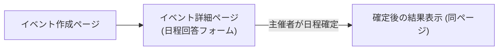

# **複数日程調整アプリ プロジェクト仕様書**

# **1. プロジェクト概要と目的（AI 駆動の開発方針）**

**プロジェクト概要:** 主催者が提示した複数の候補日程に対し、参加者が都合を回答することで、最適な日程を決定する Web アプリケーション。Next.js と Supabase で個人開発する。

**目的:** グループでのイベント調整を円滑化する。主催者はリンク共有で都合を収集、参加者はログイン不要で回答可能。決定日程の通知やカレンダー登録も簡易化する。

**AI 駆動の開発方針:** 要件定義から実装・テストまで、ChatGPT や GitHub Copilot を積極的に活用。AI をペアプログラマとし、迅速な開発を目指す。生成物は人間がレビューし、整合性・セキュリティを確保する。JsDoc や TypeScript の型定義で品質向上を図る。

**技術スタック:**

- Next.js 13 (App Router, React 18 Server Components, Server Actions)
- Tailwind CSS, DaisyUI (UI)
- Supabase (PostgreSQL, 認証, ストレージ, RLS)

原則として DB 操作は Next.js サーバー経由で行うが、RLS を有効化し、万一のフロントエンドからの直接アクセスにも備える。

# **2. ユーザー種別とフロー**

- **主催者 (Organizer):** イベント作成、候補日程登録、参加者への公開リンク共有、回答状況確認、最終日程確定、結果通知（手動）、カレンダーエクスポート。
- **参加者 (Participant/Guest):** 共有リンクからアクセス、ログイン不要で名前と各日程の参加可否を入力・送信。他の参加者の回答状況（集計）も確認可能。確定日程の確認、カレンダー登録。
  - 本アプリでは参加者は全てゲスト扱い。

**フロー補足:** 主催者・参加者は同一イベントページを利用。主催者には管理 UI（確定ボタン等）が追加表示される。アクセシビリティ（A11y）と多言語対応（i18n）は優先度低。

# **3. 機能一覧と優先度マトリクス**

**◎ 必須機能（高優先度 / MVP）**

- イベント作成機能（タイトル、説明文、複数候補日程）: 公開 URL・管理 URL 発行
- 候補日程登録 UI: 日付/日時を複数追加・削除
- 公開リンク共有機能
- 参加者の回答機能: 名前入力、各候補日時に「◯」「×」等で出欠回答。サーバーへ即時保存。
  - 回答 UI: 期間中の各時間帯（イベント作成時に単位設定）に「空き／不可」をマス目形式で入力。複数ブロック選択可。
  - 表示形式（切替可）:
    - **リスト形式**: 時間帯ごとの空き人数一覧
    - **ヒートマップ形式**: 日付 × 時間帯で空き状況を色の濃淡で可視化
- 回答状況の集計表示: 各候補日の「○ 人数/× 人数」、参加者ごと回答一覧
- 日程の最終確定機能: 主催者が 1 つ以上の時間帯を選択して確定。確定後も参加者は回答編集可能。
- 確定結果の表示: 確定日程、出席可能者のリスト表示
- カレンダー連携（エクスポート）: .ics ファイルダウンロード、Google カレンダー予定追加リンク
- レスポンシブ対応
- PWA ホーム画面機能: お気に入り・履歴一覧、URL/ID入力、インストール促進バナー

**○ 任意機能（中優先度 / 将来検討）**

- 参加者の回答編集機能
- イベント日程の追加機能: イベント作成後、誰でも候補日程を追加可能（確定済イベントも可）。既存の確定日程・回答・集計には影響なし。既存日程と時間帯が一部でも重複する場合は追加不可。
- 通知機能 (LINE 連携)
- イベント一覧/管理ダッシュボード (主催者向け)
- リアルタイム更新 (回答状況の即時反映)
- 多言語対応
- 軽微なアクセシビリティ改善

**△ 実装しない機能（低優先度 / 当面不要）**

- 外部コラボレーションツール連携 (Slack, Google Meet 等)
- 高度な認証・ユーザー管理 (OAuth 等)
- 課金・プロプラン対応
- 複雑な繰り返しイベント設定

# **4. 画面遷移図とページ構成**



- **イベント作成ページ (/create):**
  - 主要要素: イベントタイトル入力、説明入力、候補日程設定（開始日・終了日選択、時間帯指定、除外日設定）、イベント作成ボタン。
  - 入力検証: タイトル、1 つ以上の候補日程。
  - 成功時: イベント詳細ページへリダイレクト。
- **イベント詳細ページ (/event/[公開トークン]):**
  - 主要要素: イベントタイトル・説明表示。
  - 回答フォーム: 名前入力、候補日程一覧と回答入力 UI（チェックボックス等）、送信ボタン。
  - 回答状況集計表示: テーブル形式（日程別人数、参加者別回答）。
  - 最終日程確定ボタンを同ページ内に常設し、確定操作は後から変更可能。
- **確定結果表示 (同ページ、日程確定後):**
  - 回答フォームに確定日を表示（参加者は引き続き回答可能）。
  - 確定日程、出席予定者一覧を表示。
  - カレンダー追加オプション (.ics ダウンロード、Google カレンダーリンク)。
- **PWA ホーム画面 (/home):** お気に入り一覧、履歴一覧、URL/ID入力フォーム、インストール促進バナー

# **5. ディレクトリ構成とコーディング規約**

```
project-root/
├── src/
│   ├── app/
│   │   ├── layout.tsx
│   │   ├── home/          # PWAホーム画面
│   │   │   └── page.tsx
│   │   ├── page.tsx       # ホーム（LP）
│   │   ├── create/
│   │   │   └── page.tsx   # イベント作成ページ
│   │   ├── event/
│   │   │   └── [public_id]/
│   │   │       └── page.tsx  # イベント詳細ページ
│   │   └── api/
│   │       └── calendar/
│   │           ├── [event_id]/route.ts  # Google/ICSリンク生成（複数確定対応）
│   │           └── ics/[eventId]/route.ts  # ICSダウンロード（個別/複数対応）
│   ├── components/
│   │   ├── event-form.tsx
│   │   ├── availability-form.tsx
│   │   └── ...
│   └── lib/
│       ├── supabase.ts
│       ├── site-config.ts  # サイト情報一元管理
│       └── actions.ts        # Server Actions実装 (app/actions.ts に統合も検討)
├── public/
├── supabase/
│   └── migrations/
├── .env.local
└── ...
```


---

### 5.x ミドルウェア（LINEアプリ内ブラウザ対策）

- `src/middleware.ts` で LINE アプリ内ブラウザを検知し、`openExternalBrowser=1` を付与して再遷移。
- 除外パス: `/_next/*`, `/api/*`, `/logo/*`, `/favicon.ico` 等。
- 本番のみ簡易ログ出力。

**コーディング規約:**

- 言語: TypeScript (strict モード), React (関数コンポーネント+フック)
- 命名: ファイル/フォルダ=kebab-case, 変数/関数=camelCase, クラス=PascalCase, 定数=UPPER_SNAKE_CASE, SQL=snake_case
- フォーマット: Prettier
- Lint: ESLint (Next.js 標準 + 推奨)
- CSS: Tailwind CSS 直接記述、DaisyUI コンポーネント活用

---

### 5.1 コミット運用ルール

1.  **コミット粒度・頻度**: 小さな論理単位でこまめに。
2.  **コミットメッセージ書式**:

    ```
    <type>(<scope>): <短い要約>
    <詳細説明 (任意)>
    ```

    - `type`: feat, fix, docs, style, refactor, test, chore

3.  **コミット前自動チェック**: `lint-staged`＋`husky`で Prettier/ESLint 必須。

---

### 5.2 プルリクエスト運用ルール

1.  **ブランチ戦略**: Git Flow ベース (develop, release/x.y.z, hotfix/x.y.z, feature/_, bugfix/_)
2.  **PR 命名規則**: `[<type>] <ブランチ名>: <要約>`
3.  **PR 本文テンプレート**: 背景・目的, 変更内容, 確認手順, 関連 Issue, チェックリスト
4.  **レビュー要件**: 承認者 1 名以上、CI 全パス
5.  **マージ方法**: Squash and merge 原則
6.  **WIP/ドラフト PR**: 作業中は Draft 設定

---

# **6. Supabase DB 設計**

RLS を有効化。匿名キー(anon)は RLS と組み合わせ、サービスロールキー(service_role)はサーバーサイド専用。

**テーブル:**

1.  **events:**
    - `id` (UUID, PK), `public_token` (UUID, Unique), `admin_token` (UUID, Unique), `title` (text), `description` (text, NULL 可), `is_finalized` (boolean, default false), `final_date_id` (UUID, FK event_dates.id, NULL 可), `created_at` (timestamp), `created_by` (UUID, NULL 可)
2.  **event_dates:** (イベント候補日程)
    - `id` (UUID, PK), `event_id` (UUID, FK events.id, CASCADE), `start_time` (timestamp, NOT NULL), `end_time` (timestamp, NOT NULL), `label` (text, NULL 可), `created_at` (timestamp)
    - **補足:** `start_time`, `end_time` はローカルタイムとして保存・表示。タイムゾーン変換なし。
3.  **participants:** (参加者)
    - `id` (UUID, PK), `event_id` (UUID, FK events.id, CASCADE), `name` (text), `response_token` (UUID, Unique, NULL 可), `created_at` (timestamp)
4.  **availabilities:** (出欠回答)
    - `id` (UUID, PK), `event_id` (UUID, FK events.id, CASCADE), `participant_id` (UUID, FK participants.id, CASCADE), `event_date_id` (UUID, FK event_dates.id, CASCADE), `availability` (boolean), `created_at` (timestamp)

**リレーション:**

- events 1 - n event_dates
- events 1 - n participants
- events 1 - n availabilities
- participants 1 - n availabilities
- event_dates 1 - n availabilities

**制約/インデックス例:**

- `participants`: UNIQUE(event_id, name)
- `availabilities`: UNIQUE(participant_id, event_date_id)

**RLS ポリシー方針 (基本):**

- **events:** anon は SELECT 禁止。INSERT/UPDATE/DELETE は service_role のみ。
- **event_dates:** anon は SELECT 不可。操作は service_role のみ。
- **participants:** anon は特定条件下(有効な event_token)で INSERT 可、SELECT 可。UPDATE/DELETE 不可。
- **availabilities:** anon は特定条件下で SELECT 可、INSERT 可。UPDATE/DELETE 不可。
  _(サーバーサイドで service_role キーを使うため、RLS は最終防衛ライン)_

**トークン:**

- `public_token`: UUID。イベント情報取得・回答用。
- `admin_token`: UUID。イベント管理操作用。非公開。

**スキーマ例:** (仕様書記載の SQL DDL 参照)

# **7. サーバ関数（use server）による処理フロー**

Route API を使用せず、Server Actions ("use server") を用いる。

1.  **イベント作成 (createEvent):**
    - 入力: FormData (タイトル, 説明, 候補日程リスト)
    - 処理: バリデーション、DB 挿入 (events, event_dates)、トークンは DB 側で生成。
    - 出力/遷移: 作成イベントの詳細ページへリダイレクト (`/event/[public_token]`)。
2.  **回答送信 (submitAvailability):**
    - 入力: FormData (参加者名, event_token, 各候補日程の可否)
    - 処理: イベント特定、参加者取得 or 作成、古い回答削除、新回答挿入 (participants, availabilities)。
    - 出力/遷移: `revalidatePath`で同イベントページを再検証・更新。
3.  **日程確定 (finalizeEvent):**
    - 入力: 確定する event_date_id と event_id。
    - 処理: event_id を基に DB 更新 (events.is_finalized=true, events.final_date_id=確定 ID)。
    - 出力/遷移: `revalidatePath`で同イベントページを再検証・更新。

**型付き I/O:** TypeScript で型定義。Supabase クライアントに DB スキーマ型を指定。

# **8. カレンダー連携の実装方針（Google / ICS）**

実装は複数確定日程に対応し、ローカル時間をそのまま扱います。

- ルート構成:
  - `app/api/calendar/[event_id]/route.ts`
    - Google カレンダーリンク生成（`?googleCalendar=true`）。`dateId` 指定で個別日程、未指定で最初の確定日程。
    - ローカル時間を使用し、`ctz=Asia/Tokyo` 等のタイムゾーンを明示。
  - `app/api/calendar/ics/[eventId]/route.ts`
    - ICS 生成・ダウンロード。複数 VEVENT を1ファイルに出力（`dateId` 指定で個別）。
    - ICS はローカル時間（Z なし）。

- 例:
  - Google: `/api/calendar/<event_id>?googleCalendar=true&dateId=<event_date_id>`
  - ICS: `/api/calendar/ics/<event_id>?dateId=<event_date_id>`

- 補足（タイムゾーン/日時処理）:
  - DB 保存の `start_time`/`end_time` はローカルタイムを前提とし、そのまま出力。
  - Google には `ctz` を付与。ICS では UTC 変換せず `YYYYMMDDTHHMMSS`（Z なし）で記述。

# **9. ワイヤーフレーム構成（テキストベース）**

(仕様書のワイヤーフレーム記述は簡潔で分かりやすいため、ここでは主要な変更点のみ記載)

- **[ページ] 新規イベント作成:** 候補日程入力は日付/時間選択。
- **[ページ] イベント詳細・回答:**
  - 出欠入力: 候補日程ごとにチェックボックス（参加可）またはマス選択。
  - 回答状況: リスト形式（時間帯別空き人数）とヒートマップ形式（日付 x 時間帯の色分け）を切り替え可能。
- **[ページ] イベント確定後:**
  - 確定日程、出席予定者リスト表示。
  - カレンダー追加ボタン (.ics, Google Calendar)。

# **10. メンテナンス設計と運用時の無料制約考慮**

**Supabase 無料プラン制約と対策:**

- リソース上限: 500MB DB, 5GB 帯域/月。テキスト中心のため当面問題なし。
- 自動バックアップ無し: 手動エクスポート、または GitHub Actions 等で自動ダンプ取得検討。
- 休眠と起動遅延: UptimeRobot 等で定期アクセスし休眠防止。
- 同時接続とクエリ性能: インデックス活用、重い集計回避。

**Next.js ホスティング (Vercel/Cloudflare Pages 無料プラン):**

- Vercel: 100GB 転送/月。
- Cloudflare Pages: 代替検討。
- Cloudflare CDN: 基本不要。DNS 管理は有益。

**運用とメンテナンス:**

- モニタリング: 月 1 回程度の手動ヘルスチェック。Vercel アラート、Sentry 導入検討。
- データ整理: 古いイベントデータの定期削除。
- LINE 連携: 当面行わず、主催者による手動連絡を前提。結果画面のコピー UI 配慮。
- セキュリティ: 依存パッケージの定期更新 (Dependabot)。

# **11. テスト・監視・バックアップ戦略（無料枠を活かす）**

## テスト戦略（2025 年 5 月時点）

- **Jest ＋ TypeScript で全テスト実装・管理。**
- テストディレクトリ: `src/lib/__tests__/`, `src/components/__tests__/`
- 主なテスト内容: サーバーアクション、カレンダー連携、バリデーション、型安全性など。
- 注意点: 型エラー・Lint エラー無しで実行・コミット。モックやポリフィル使用時は理由コメント。

**監視:**

- 稼働監視: UptimeRobot (5 分ごと GET リクエスト)。
- ログ監視: Vercel/Cloudflare Pages のログ確認。
- エラー通知: Sentry 無料プラン導入検討。
- Supabase 監視: Supabase ダッシュボードのメトリクス確認。

**バックアップ戦略:**

- 手動バックアップ: Supabase 管理画面から DB エクスポート (SQL ダンプ)。
- 自動バックアップ: GitHub Actions で`pg_dump`または Supabase CLI `db dump`実行。
- 設定バックアップ: スキーマ定義 SQL、その他設定のドキュメント化。

# **12. 次に行う具体的なアクション**

1.  リポジトリ初期化 (Next.js, TypeScript, App Router, ESLint, Prettier)。
2.  Tailwind CSS + DaisyUI 導入・設定。
    - `postcss.config.mjs`設定。
    - `app/globals.css`に `@import "tailwindcss"; @plugin "daisyui";` を記述 (または `@tailwind base;` 等)。`layout.tsx`で`globals.css`をインポート。
3.  DB 設計に基づき Supabase テーブル・RLS ポリシー設定。
4.  イベント作成機能 (UI、Server Action) 実装。
5.  イベント詳細表示・回答機能 (UI、Server Action) 実装。
6.  日程確定機能 (UI、Server Action) 実装。
7.  カレンダー連携機能 (.ics 生成 API、Google カレンダーリンク生成) 実装。
8.  テストコード記述 (Jest)。
9.  Vercel/Cloudflare Pages へのデプロイ設定。
10. README 作成、運用手順ドキュメント化。

---

## 【追記】イベント日程追加機能の仕様

### 概要

- イベント作成後、イベント詳細ページから候補日程(event_dates)を追加可能。
- 誰でも追加可（確定済イベントも可、管理者権限不要）。
- 既存の確定日程・回答・集計・UI 表示には影響なし。
- **既存日程と一部でも時間帯が重複する場合は追加不可**（エラー表示）。
- UI はイベント作成時と同様の「範囲指定＋時間帯選択」。控えめに配置（折りたたみ等）。

### 画面構成

- イベント詳細ページに「日程追加」セクション（折りたたみ/モーダル等）。
  - 「日付範囲＋時間帯」指定 UI。
  - 追加ボタンでサーバーアクション呼び出し（バリデーション、DB 追加、UI 更新）。
  - 重複時エラー表示。成功時、候補日程リスト・集計に即時反映。

### テスト・運用

- サーバーアクション（event_dates 追加）の正常系・異常系（重複エラー）テスト。
- UI コンポーネントの E2E テスト。
- 既存機能への影響がないかテスト。

---

**カレンダー連携の日時について（仕様書 8 章、12 章【追記】より再確認）**

- .ics ファイル生成時および Google カレンダー連携時、DB に保存された日時値（ローカルタイム）を**そのまま利用**します。
- タイムゾーン変換や UTC への自動変換は**行いません**。
- 例: `2024-04-02 10:00` と保存されていれば、その地域の `10:00` として扱います。
- カレンダーアプリ側のタイムゾーン解釈によるズレを避けるため、日時の扱いに注意して実装してください。
